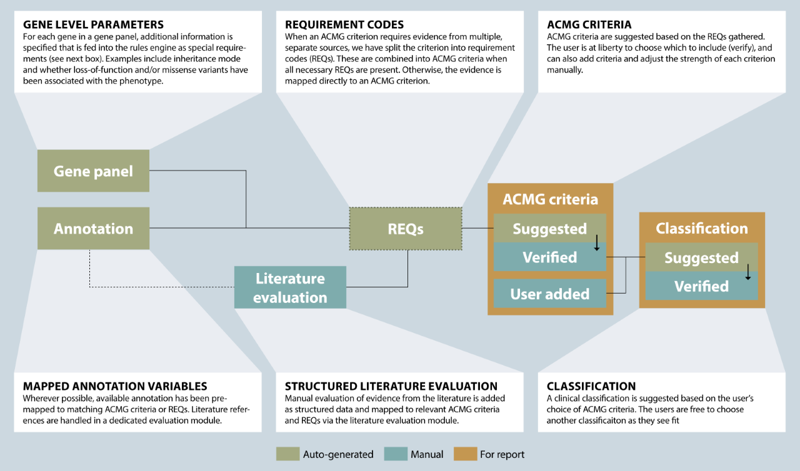

# ACMG rules engine

[[toc]]

## Generating suggestions

ELLA suggests ACMG criteria and classifications based on the official guidelines described in [Richards et al. 2015](https://www.ncbi.nlm.nih.gov/pubmed/25741868). To achieve this, certain ACMG criteria have been split into more granulated gene panel parameters and requirements (REQs), prior mapping of annotation to these codes, as well as structuring data gathered from user evaluation of literature references and studies.

Note that these suggestions do not remove the need for expert judgement: The suggestions generated for both ACMG criteria and variant classifications need to be verified and may be overridden, and you may also add ACMG criteria manually. **Figure 1** below gives an overview of this process:

**Figure 1**: Key elements in the process of generating suggested ACMG criteria and clinical classification in ELLA.

Also note that classification suggestions only include class 1-5 (not class U or DR), and any non-ACMG ("other") or ACMG criteria set as "not weighted" are disregarded in the calculation. 

## REQ: Requirements

When a single piece of information (either in the annotation or from user input) is not enough to satisfy all the requirements of a particular ACMG criterion, we have split the rules for that criterion into subparts. We have named these criteria "REQ" for "requirement", and each REQ is a necessary component for the ACMG criterion/criteria it belongs to.

There are two different kinds of REQs, those that are derived from the annotation or from user action (e.g. reference evaluation), and those that are predefined in the gene panel. The latter are prepended with “GP” (gene panel).

An example is the BP1 criterion (benign supportive; missense variant in a gene for which primarily truncating variants are known to cause disease), which can be split up in these two REQs: "missense" (missense variant) and "GP LOF only" (only loss of function variants in this gene cause disease). Note that both of these REQs must be present for BP1.

## Gene-specific rules

A number of parameters for the ACMG rules engine can be set per gene (separate settings for each user group). The configured settings for each gene in an open analysis/interpretation is visible by clicking on the gene name in the [top bar of the CLASSIFACTION page](../manual/top-bar.md).

The following parameters is currently possible to configure per gene (see [Technical documentation](/technical/acmg.html#gene-specific-overrides) for details):

- The population frequency thresholds for ACMG criteria BA1/BS1, with possibilities for additional "allele number" thresholds and separation of dataset groups (e.g. external/internal). 
- Disease mode: Whether only missense (`MISS`) or loss of function (`LOF`) mutations, or both (`ANY`), are expected to cause disease in the gene.
- Whether the last exon is important (`LEI`) or not (`LENI`).
- Gene comment: Information relevant to evaluation of more/all variants in a gene.