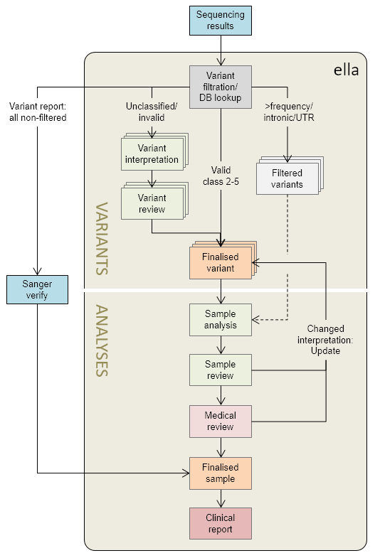

# Workflows

[[toc]]

*ella* allows both interpretation of individual [VARIANTS](#variant-centered-workflow-variants) (independent of laboratory samples), and [ANALYSES](#sample-centered-workflow-analyses) of variants in the context of a sample and a pre-specified gene panel. The most important difference is that the VARIANTS workflow does not show any sample-specific information/functionality, which includes:

  - Genotype
  - Quality of the variant call (read depth, allele balance, mapping quality, etc.)
  - Genotyping method (e.g. HTS or Sanger)
  - Sample(s) information
  - Other variants in the same sample
  - Possibility for generating a clinical report

Most users will default to [ANALYSES](#sample-centered-workflow-analyses) as this is the only workflow that allows completion of samples. However, in certain cases (typically high sample volume, small gene panels, multiple collaborating users) the [VARIANTS](#variant-centered-workflow-variants) workflow may be preferred. You may also go directly to a variant or analysis by using the [search function](/manual/choosing-sample-variant.html#search-and-edit-variants-and-samples).

Common to both workflows is that any analysis or variant interpretation should normally be reviewed. However, all steps are optional, and you may finalise at any time. 

## Sample-centered workflow: ANALYSES

An ANALYSIS is tied to both a specific laboratory sample and a gene panel. Note that this means that, although rare, the same patient may be present in multiple analyses. In these instances, each analysis is treated separately, and it is not possible to merge results. 

A schematic representation of a possible workflow that starts with ANALYSES is shown in **Figure 1**.

**Figure 1:** Sample-centred workflow. Valid classifications are defined as \<6 month old. ”Sample review” is optional, and may be omitted for low-complexity samples (e.g. only benign variants and/or still valid existing classifications).

## Variant-centered workflow: VARIANTS

An alternative, more complex workflow starting with a VARIANTS workflow followed by ANALYSES is presented in **Figure 2**.

**Figure 2:** Variant-centred workflow followed by sample analysis

This workflow is particularly well suited for small gene panels and high sample volumes, where a group of analysts collaborate on the same set of samples and variants. 

::: warning NOTE
Variants that have first been started in ANALYSES mode are not visible in VARIANTS mode. Moreover, variants that have been finalised in ANALYSES mode first are not visible under FINISHED variants in VARIANTS mode. It is therefore recommended to always follow a workflow similar to that in **Figure 2** when using VARIANTS mode.
:::
