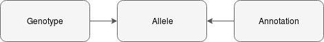
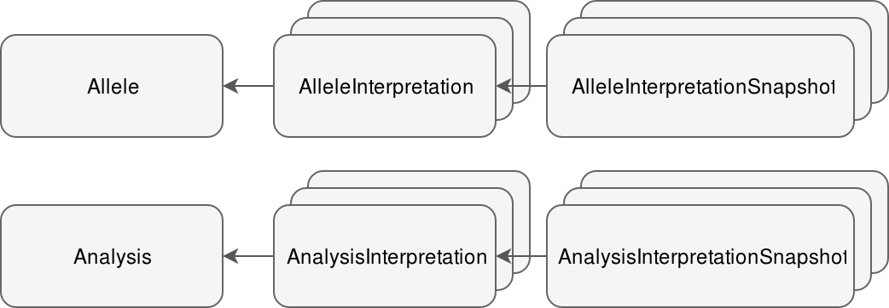

# Datamodel

The datamodel is defined using [SQLAlchemy](https://www.sqlalchemy.org).

It's implementation can be found in `src/vardb/datamodel/`.

## Concepts

The main concepts of the datamodel are listed below. This is meant to serve as a simple introducation, describing the basics, it's not an exhaustive list of all the tables and some fields are omitted.

### Genetic data and annotation

Genetic data, currently genetic variation represented as SNVs and indels, are stored in the `allele` table.

#### Allele

An allele represents a change with regards to a reference genome. It's among the most important objects in the mode, and if combined with an annotation it can exists in isolation. The allele tables contains, among others, the following data:

- Reference genome version
- Chromosome
- Start and stop position
- Change from/to
- Change type (snv, ins, del, insdel)
- Original vcf entries (REF, ALT, POS)

#### Annotation

The annotation contains information about a *single* allele's population frequencies, predicted effects and various other data from external databases. Annotation can change often, and whenever it is updated, the previous annotation is archived. Therefore there is only one current annotation for every allele.

The annotation tables contains, among others, the following data:

- Annotation data (json)
- Date created

#### Genotype

### Classifications and assessments

#### AlleleAssessment

#### AlleleReport

#### Reference

#### ReferenceAssessment

### Analyses and samples

#### Analysis

#### Sample

### Workflow

#### AlleleInterpretation

#### AlleleInterpretationSnapshot

#### AnalysisInterpretation

#### AnalysisInterpretationSnapshot
