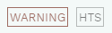
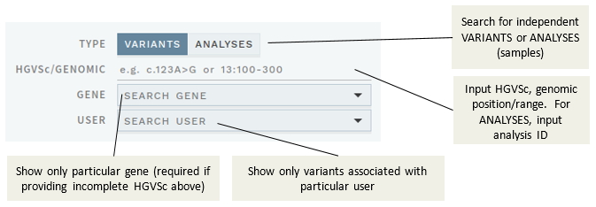
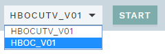

# Choosing a sample or variant 

[[toc]]

The first page you see after logging in is the OVERVIEW page. You can always navigate to this page using the link in the top right corner:

 

This page also links to the current documentation (you can also reach these by going to [allel.es/docs](http://allel.es/docs)): 

## Select analysis or variant from the worklist

Depending on how ELLA is configured, the vertical buttons in the left margin of the OVERVIEW page may include buttons for either `ANALYSES` or `VARIANTS`, or both: 

For an in-depth explanation of the difference between an ANALYSES workflow and a VARIANTS workflow, see [Concepts](/concepts/workflows.md). Most importantly: 

- ANALYSES are tied to a specific laboratory sample and gene panel.
- VARIANTS are stand-alone variant interpretations, and therefore contains no sample-specific information (e.g. genotype and variant calling quality).

### ANALYSES worklist

In the ANALYSES view, you may choose from one or more of the following: 

Option  | Explanation
:--- | :---
`NOT READY` | Imported analyses where a variant needs validation or regions are insufficiently covered. The variants in these samples should not be interpreted until validation/sequencing of missing regions has been performed.
`YOUR ANALYSES` | Any unfinished analyses that you have started and saved, but not completed.
`PENDING INTERPRETATION`  | Samples that have not yet been opened by any user.
`PENDING REVIEW`  | Samples that have been interpreted by another user and marked for review.
`PENDING MEDICAL REVIEW`  | Samples marked for review by a lab physician.
`OTHERS’ ANALYSES`  | Samples currently being worked on by other users.
`FINALISED` | Samples that have been analysed and marked as Finalised.

#### Optional/alternative ANALYSES worklist items

Depending on configuration, some of the worklist items may have been swapped by other alternatives. 

Optional replacements for `PENDING INTERPRETATION`:

Option  | Explanation
:--- | :---
`WITH FINDINGS: CLASS 3-5`  | Samples that have at least one variant previously classified as class 3, 4 or 5.
`ONLY NORMAL: CLASS 1-2 + U`  | Samples where all variants have been classified as Class 1, 2 or U.
`MISSING CLASSIFICATIONS` | Samples that have not yet been opened/analysed and where there are no previously classified class 3-5 variants.

Optional replacements for `PENDING REVIEW`:

Option  | Explanation
:--- | :---
`PENDING REVIEW - WITH FINDINGS: CLASS 3-5` | Samples that have at least one variant previously classified as class 3, 4 or 5.
`PENDING REVIEW - ONLY NORMAL: CLASS 1-2 + U` | Samples where all variants have been classified as Class 1, 2 or U.
`PENDING REVIEW - MISSING CLASSIFICATIONS`  | Samples that have not yet been opened/analysed and where there are no previously classified class 3-5 variants.

### VARIANTS worklist

In the VARIANTS view, you may choose from one or more of the following:

Option  | Explanation
:--- | :---
`YOUR VARIANTS` | Any unfinished variant interpretations that you have started and saved from a previous session.
`PENDING CLASSIFICATION` | Variants that have not yet been opened/interpreted.
`PENDING REVIEW` | Variants that have been interpreted at least once and that have been marked for review. Users and dates for previous interpretations are given to the far right.
`OTHERS’ VARIANTS` | Variants currently being worked on by other users.
`FINALISED` | Variants that have been interpreted and marked as Finalised.

## History, comments and tags

For both ANALYSES and VARIANTS view, each analysis/variant is marked with the date when the sample/variant was loaded into ELLA (sorted with oldest on top) and, if present, user and date of previous interpretation rounds along with any [overview comments](/manual/top-bar.html#work-log) provided by the previous analyst. 

In the ANALYSES view, samples are marked with the source of the data (HTS or SANGER, or both), as well as a [WARNING](/manual/info-page.html#pipeline-warnings) from the variant calling pipeline if relevant:

## Search (and edit) variants and samples

To search for a particular variant or analysis (past or present), use the search section at the top of the OVERVIEW page:

Possible searches include HGVS cDNA or protein variant name with or without reference ID, genomic position/range and analysis ID. Examples:

  - `c.198A>G`
  - `NP_075561.3:p.Gly1248Asp`
  - `13:32890607`
  - `13:32890500-32890800`
  - `NA12878`

Search results may be narrowed further by selecting gene or user, or by ignoring excluded variants (see figure above).

Clicking on a variant search result will open the variant in a VARIANTS workflow. Note that to (re-)interpret the variant, ELLA has to tie the interpretation to a gene panel. Check that the correct gene panel is chosen in the dropdown next to the `START` button, *before* you start:

