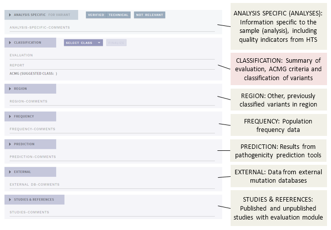
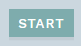
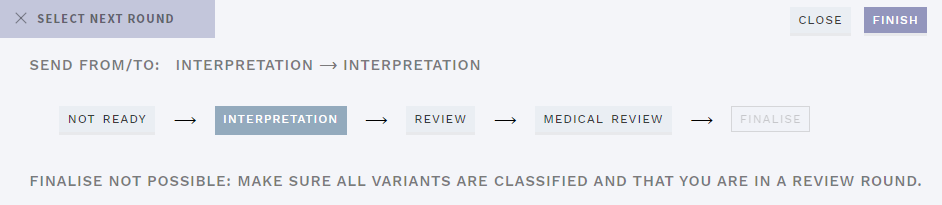
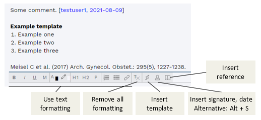
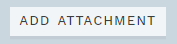
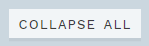
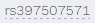
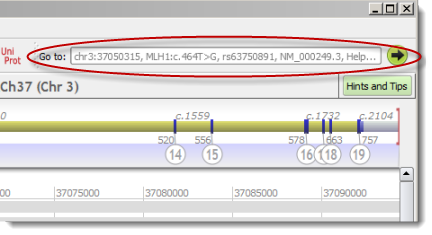

# Classification page: Overview and basics

[[toc]]

The CLASSIFICATION page contains all annotation, as well as tools for interpretation and classification of each variant. Navigate to this page by using the button in the left corner of the top bar (if no warnings are present, you will start on this page automatically):

## Sections on the CLASSIFICATION page

Different information is placed in separate parts or sections (shown here in collapsed mode, see  
[Use collapsing ...](/manual/classification-page.html#use-collapsing-for-overview-and-marking-sections-as-done)):

The different parts are described in more detail in separate pages in this manual:

  - [Filtered variants](/manual/filtered-variants.html): View and optionally add back variants that have been removed from view.
  - [Work log](/manual/worklog.html): System and user messages related to current analysis/interpretation.  
  - [Top bar](/manual/top-bar.html): Info and actions.
  - [Side bar](/manual/side-bar.html): Variant list with tags and quick classification.
  - [Evidence sections](/manual/evidence-sections.html): Evaluate annotation and studies.
  - [Classification section](/manual/classification-section.html): Summarise and set ACMG criteria and classification.

## Start an analysis or interpretation

To start an analysis or interpretation, click the green `START ...` button in the top bar (right):

This reserves the variant or analysis for your user and marks it as ongoing for other users. If you don’t click start, the variant or analysis and previous user comments or choices are mostly read-only.

## Save and finish

Buttons for saving and finishing your analyses are in the right corner of the top bar:

### Saving unfinished work

There is currently no auto-save feature in *ella*, so please make sure to use the `SAVE` button on a regular basis. The button will be purple when there are unsaved changes. Note that if you try to exit the interpretation or close the browser with unsaved changes, you will get a warning first, which will allow you to go back and save your work.

### Finalise an analysis or interpretation 

When you are satisfied with the analysis of a variant or a sample, press the `FINISH` button (this also automatically saves your work). You are then shown the complete workflow with options to change workflow state (to cancel, click anywhere outside the pop-up), shown below for an ANALYSES workflow:

The option selected by default is your current workflow state, and you may change to a different state (most common) or stay in the same state. The options are:

Option  | Explanation | Note
:--- | :--- | :---
`NOT READY`  | Analysis (sample) is not ready for interpretation  | ANALYSES only
`INTERPRETATION`  | Analysis (sample)/variant is ready for interpretation, and has not been looked at by anyone yet.
`REVIEW`  | Interpretation of the analysis (sample)/variant has been performed and is ready for to be reviewed by another user. Choosing this puts the analysis or variant into the PENDING \[..\] list on the front page.
`MEDICAL REVIEW`  | Interpretation of the analysis (sample) has been finished by the lab but must be reviewed by a lab physician. Choosing this puts the analysis or variant into the PENDING MEDICAL REVIEW list on the front page.  | ANALYSES only; optional
`FINALISE`  | If you have reviewed another user’s analysis and/or are confident that the analysis/interpretation does not need further review (medical or otherwise), you may instead FINALISE. Choosing this puts the sample or variant (depending on the workflow) into the FINISHED list on the front page.

Remember that you can also leave an Overview comment for the next user in the [work log](/manual/top-bar.html#work-log).

## Comments and attachments

### Formatting, templates and references

Each section on this page has a comment field, which should be used for making notes about the particular evidence you find in each section. Most comment fields have the possibility for changing basic text formatting by using the menu below the comment field: 

The menu also includes buttons for adding pre-defined templates (can be configured independtly for specific fields), as well as references from the STUDIES & REFERENCES section. Insert a template or reference by clicking the `+` sign in the pop-up. If no template has been defined or no reference has been found/added (STUDIES & REFERENCES section), the respective buttons will be inactive (greyed out).

::: tip TIP
Pasting content copied from an external source, such as a web page or Word, can in some cases produce strange text formatting results. If this is the case, try pasting as plain text (`Ctrl` + `Shift` + `V`) instead.
:::

### Attachments

Image attachments copied to the clipboard may be pasted into any of the section comment fields. Pasted images are added inline to the comment text, and can be zoomed in/out using the slider at the top left of each image. 

In addition, files of any type (\<50 MB) may be added to *ella* using the `ADD ATTACHMENT` button in the top banner:

Attachments added this way are available (through thumbnails) in the CLASSIFICATION section. NB: Attachments are given a number as name, the original file name is lost.

## Example classification workflows

Recommended workflows for each variant on the CLASSIFICATION page, after clicking the `START …` button in the top bar:

### Analyse new variants (no previous interpretation)

1.  Review the information in the [QUALITY](/manual/evidence-sections.html#quality) (ANALYSES workflow only), [FREQUENCY](/manual/evidence-sections.html#frequency), [EXTERNAL](/manual/evidence-sections.html#external) and [PREDICTION](/manual/evidence-sections.html#prediction) sections, add missing information and provide comments specific to each section when relevant.

    a.  (Optional; in ANALYSES workflow): Clear analysis warnings using the [work log](/manual/top-bar.html#work-log).

2.  Evaluate the retrieved references and any references you add yourself in the [REFERENCES](/manual/evidence-sections.html#references) section.

3.  In the [CLASSIFICATION](/manual/classification-section.html) section:
    
    a.  Review and choose ACMG criteria, add comments when necessary.  
	  b.  Provide a summarising comment for the variant and set a classification.

4.  If in the ANALYSIS workflow:
    
    a.  Move to next variant in the [sidebar](/manual/side-bar.html) until no more variants are left.  
	  b.  Switch to the [REPORT](/manual/report-page.html) page and make a clinical report for the sample.

5.  Once all variants have been interpreted (only one if in VARIANTS workflow):
    
    a.  (Optional): Provide an overview comment or message for the next user using the [work log](/manual/top-bar.html#work-log).  
	  b.  Press `FINISH` in the top bar and [send to review/medical review or finalise](#finish-an-analysis-or-interpretation).

### Review previous interpretation

1.  Review the comments and choices made by the previous user in each section and make changes/additions as you see fit

2.  Once all variants are reviewed, review the report (if in ANALYSES mode) and finish the session as from point 4 above.

## Tips

### Use collapsing for overview and marking sections as done

To get a better overview of the comments you have added in the different sections for a variant, use the `COLLAPSE ALL` button in the top bar:

Alternatively, you may collapse each section individually by clicking on the section header. As the collapsed/expanded state of each section is saved along with your interpretation, this can be useful for marking sections as done if you need to quit for the day without being entirely finished with a variant.

### Links to the web and Alamut

Throughout this page and often in card headers, you will find weblinks, usually to the sources of various annotation data, as well as buttons for exporting analyses or individual variants to Alamut. Weblinks are marked with a dotted line under the text, e.g.:

If you are in an offline environment, when you click one of these, instead of opening a browser or the program directly, the link is copied to your clipboard. To open the link:

  - For weblinks, click on the link, then (as you get the message COPIED LINK TO CLIPBOARD) open a browser on your local computer and paste (Ctrl+V) the contents into the address bar, then hit Enter

  - For Alamut, click either `COPY ALL TO ALAMUT` or `COPY VARIANT TO ALAMUT` in the top bar, then (as you get the message COPIED TEXT TO CLIPBOARD) paste (Ctrl+V) the contents in the "Go to:" input field at the top right of the Alamut main window:  
      
    

