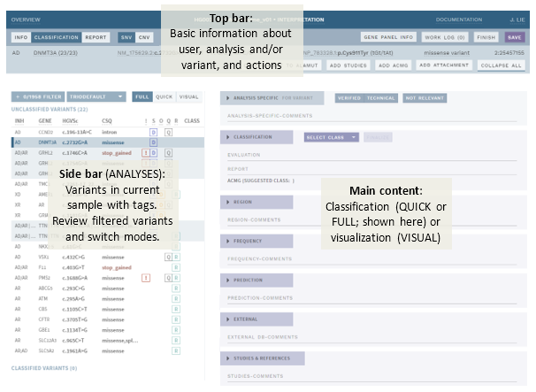

# Classification page: Overview and basics

[[toc]]

The CLASSIFICATION page contains all annotation, as well as tools for visualizing, interpreting and classifying each variant. Navigate to this page by using the button in the left corner of the top bar (if no warnings are present, you will start on this page automatically):

 

## Overview 

This page has three main parts (go to links for further details), a top bar, a side bar and the main content: 

 

- [Top bar](/manual/top-bar.html): 
  - Basic information and actions related to an analysis and/or selected variant.
  - Access the [work log](/manual/worklog.html), which contains system and user messages related to current analysis/interpretation.
  - Show [gene panel info](/manual/info-page.html#gene-panel-info).  
- [Side bar](/manual/side-bar.html) (ANALYSES only). : 
  - Variant list with tags. 
  - Review [filtered variants](/manual/filtered-variants.html).
  - Switch between FULL, QUICK and VISUAL modes (see below).
- Main content. This has three different modes: 
  - FULL mode (default): Includes [Evidence sections](/manual/evidence-sections.html), where you review and add evidence, and a [Classification section](/manual/classification-section.html), where you summarize findings and set a classification.
  - [QUICK mode](/manual/quick-classification.md): An expanded side bar where you can more quickly set a classification or mark variants in a list.
  - [VISUAL mode](/manual/visual.md): Visualize variants, bam files and tracks, and quickly mark variants as TECHNICAL.

See also [Variant warnings](/manual/warnings.md) for various warnings that may be displayed when viewing a variant. 

## Start interpretation

To start an analysis or variant interpretation, click the green `START ...` button in the top bar (right):

This reserves the variant or analysis for your user and marks it as ongoing for other users. If you don’t click start, the variant or analysis and previous user comments or choices are mostly read-only.

If the analysis has been opened and not finished by another user, the start button is replaced with a `REASSIGN TO ME` button:

Choosing this means you will take over responsibility for the analysis from the current user. 

## Save and finish

Buttons for saving and finishing your analyses are in the right corner of the top bar:

### Saving unfinished work

There is currently no auto-save feature in ELLA, so please make sure to use the `SAVE` button on a regular basis. The button will be purple when there are unsaved changes. Note that if you try to exit the interpretation or close the browser with unsaved changes, you will get a warning first, which will allow you to go back and save your work.

### Finish an analysis or interpretation 

When you are satisfied with the analysis of a variant or a sample, press the `FINISH` button (this also saves your work). You are then shown the complete workflow with options to change workflow state. By default, your current workflow step is selected:

::: tip TIP
Remember that you can also leave an Overview comment for the next user in the [work log](/manual/top-bar.html#work-log). This should be done before finishing the analysis.
:::

The workflow options are:

Option  | Explanation
:--- | :--- | :---
`NOT READY`  | For ANALYSES only. Analysis (sample) is not ready for interpretation.
`INTERPRETATION`  | Analysis (sample)/variant is ready for interpretation, and has not been looked at by anyone yet.
`REVIEW`  | Interpretation of the analysis (sample)/variant has been performed and is ready for to be reviewed by another user. Choosing this puts the analysis or variant into the PENDING\[...\] list on the front page.
`MEDICAL REVIEW`  | For ANALYSES only. Interpretation of the analysis (sample) has been finished by the lab but must be reviewed by a lab physician. Choosing this puts the analysis or variant into the PENDING MEDICAL REVIEW list on the front page. 
`FINALIZE`  | If you have reviewed another user’s analysis and/or are confident that the analysis/interpretation does not need further review, you may FINALIZE the analysis. Choosing this puts the sample or variant (depending on the workflow) into the FINISHED list on the front page. Note that all new/updated classified variants in the analysis must be [finalize individually](/manual/classification-section.html#finalize-variant) before this option is available.

## Comments and attachments

### Formatting, templates and references

Each section on this page has a comment field, which should be used for making notes about the particular evidence you find in each section. Most comment fields have the possibility for changing basic text formatting by using the menu below the comment field: 

The menu also includes buttons for adding pre-defined templates (can be configured independently for specific fields), as well as references from the STUDIES & REFERENCES section. Insert a template or reference by clicking the `+` sign in the pop-up. If no template has been defined or no reference has been found/added (STUDIES & REFERENCES section), the respective buttons will be inactive (greyed out).

::: tip TIP
Pasting content copied from an external source, such as a web page or Word, can in some cases produce strange text formatting results. If this is the case, try pasting as plain text (`Ctrl` + `Shift` + `V`) instead.
:::

### Attachments

Image attachments copied to the clipboard may be pasted into any of the section comment fields. Pasted images are added inline to the comment text, and can be zoomed in/out using the slider at the top left of each image. 

In addition, files of any type (\<50 MB) may be added to ELLA using the `ADD ATTACHMENT` button in the top banner:

Attachments added this way are available (through thumbnails) in the CLASSIFICATION section. Hover your mouse pointer over the thumbnail to see details. 

## Links and copying

### Links to the web and Alamut

Throughout this page and often in card headers, you will find weblinks, usually to the sources of various annotation data, as well as buttons for exporting analyses or individual variants to Alamut. Weblinks are marked with a dotted line under the text, e.g.:

If you are in an offline environment, when you click one of these, instead of opening a browser or the program directly, the link is copied to your clipboard. To open the link:

  - For web links, click on the link, then (as you get the message COPIED LINK TO CLIPBOARD) open a browser on your local computer and paste (Ctrl+V) the contents into the address bar, then hit Enter

  - For Alamut, click the `COPY VARIANT TO ALAMUT` in the top bar, then (as you get the message COPIED TEXT TO CLIPBOARD) paste (Ctrl+V) the contents in the "Go to:" input field at the top right of the Alamut main window:  
      
    

### Copy text in pop-ups on mouse-click

Many pop-ups has a function to copy text directly when you click on the text. Look for the clipboard symbol, e.g. in the HGVS cDNA variant name in the top bar: 

## Collapse/expand sections

To get a better overview of the comments you have added in the different sections for a variant, use the `COLLAPSE ALL` button in the top bar:

Alternatively, you may collapse each section individually by clicking on the section header. 

::: tip TIP
Use collapsing for marking sections as done. As the collapsed/expanded state of each section is saved along with your interpretation, this can be useful for marking sections as done if you need to quit for the day without being entirely finished with a variant.
::: 

## Example classification workflow

Example ANALYSIS workflow for full classification of variants on the CLASSIFICATION page, after clicking the `START …` button in the top bar:

1.  Review the information in the [QUALITY](/manual/evidence-sections.html#quality), [FREQUENCY](/manual/evidence-sections.html#frequency), [EXTERNAL](/manual/evidence-sections.html#external) and [PREDICTION](/manual/evidence-sections.html#prediction) sections, add missing information and provide comments specific to each section when relevant.

    a.  (Optional): Review aligned raw data and genomic context in [VISUAL mode](/manual/visual.md) 
    b.  (Optional): Clear any analysis warnings using the [work log](/manual/top-bar.html#work-log).

2.  Evaluate studies and references, including any you add yourself in the [STUDIES & REFERENCES](/manual/evidence-sections.html#references) section.

3.  In the [CLASSIFICATION](/manual/classification-section.html) section:
    
    a.  Review and choose ACMG criteria, add comments when necessary.  
	b.  Provide a summarizing comment for the variant and set a classification.
    c.  If you regard the classification as final and no further review is necessary, press the `FINALIZE` button next to the classification dropdown.

4.  Move to the next variant in the [sidebar](/manual/side-bar.html) and repeat steps 1-3 above until no more variants are left.  

5.  Switch to the [REPORT](/manual/report-page.html) page and make a clinical report for the sample.

6.  Once all variants have been interpreted:
    
    a.  (Optional): Provide an overview comment or message for the next user using the [work log](/manual/top-bar.html#work-log).  
	b.  Press `FINISH` in the top bar and [send to review/medical review or finalize](#finish-an-analysis-or-interpretation).