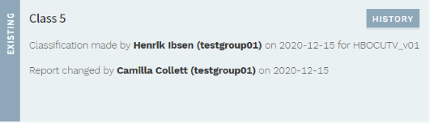
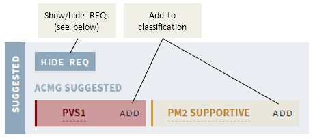
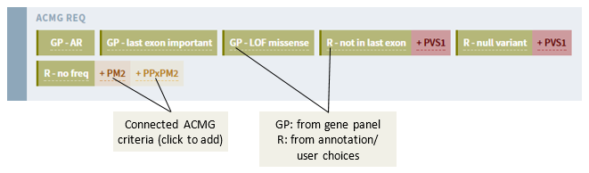
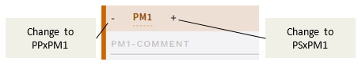
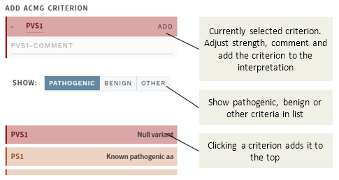
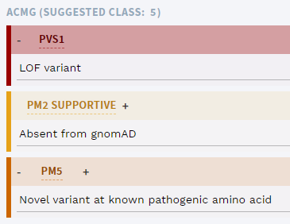
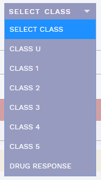

# Classification section: Summarise and set ACMG criteria and classification

[[toc]]

This section is where you review the information from other sections, summarise your findings, add ACMG criteria and set a classification. In other words, for variants with no pre-existing interpretation, you should review the other sections first. The reason it comes first is to make conclusions from any previous interpretations immediately visible when you open a variant.

## Evaluation and Report: Summarising comments

Unlike other sections, this section contains two main comment fields:

  - EVALUATION: For summarising the evaluation of the consequence of the variant. This should be detailed enough for making an informed decision, but leaving the specifics to comments in respective sections.
  - REPORT: Comments regarding clinical evaluation (automatically included in the final patient report).

## Variants with a previous interpretation

*ella* matches the variants in each new sample with existing variant interpretations in the database. If a match is found, the last classification along with user, date and any changes to the report is displayed in a separate card:

Clicking the `HISTORY` button shows a more detailed history including ACMG criteria and comments, for every previously finalised round of interpretation, ordered by date.

### Interpretations that are still valid

Previously finalised variant interpretations have a limited period where they are still considered valid, after which they should be re-evaluated. Variant interpretations that are still valid are shown with a green background and automatically accepted. However, it is still possible to do a re-interpretation of these variants, by clicking the `REEVALUATE` button in the section banner (only available if the analysis/interpretation has been started). To undo any new interpretation (and avoiding resetting the validity period), click the `UNDO REEVALUATION` button:

::: warning NOTE
Changing the REPORT field only does not reset the validity period.
:::

## Review and add ACMG criteria 

The ACMG criteria in *ella* are based on the official [ACMG-AMP 2015 guidelines](https://www.ncbi.nlm.nih.gov/pubmed/25741868). *ella* automatically [suggests relevant ACMG criteria](/concepts/acmg-rule-engine.html) based on a mapping of the annotation from the HTS bioinformatics pipeline, as well as any information you have added manually, to these adapted criteria. Suggested criteria are shown in the SUGGESTED card:

The specific requirements for each criterion are available by clicking on the label. The resulting pop-up also contains (where applicable):

  - Notes: From official [ACMG-AMP 2015 guidelines](https://www.ncbi.nlm.nih.gov/pubmed/25741868)
  - Local adjustments: Notes specific to your own setup
  - Match: What triggered the suggestion (this is still in development and may be somewhat cryptic or not available)

::: warning NOTE
The suggestions may be somewhat imprecise and **you should always check that all requirements are satisfied** before clicking ADD. This adds the criterion to the classification, shown as a list above the SUGGESTED card.
:::

### REQ: requirements for ACMG criteria

Where possible, some of the ACMG criteria have been split into separate [“requirements” (REQs)](/concepts/acmg-rule-engine.html#req-requirements-for-acmg-criteria) in *ella*. Each of these REQs is a necessary component for the ACMG criteria they belongs to. *ella* displays these REQs for information, which can be used as hints for additional criteria that may be relevant for the current variant. 

REQs that have a match in the current variant are shown when you click the `SHOW REQ` button:

## Modifying the strength of added criteria

To change the strength of a particular, added criterion, click either the `+` or `-` sign, for stronger or weaker evidence, respectively:

## Add ACMG criterion manually

To add an ACMG criterion that is not already suggested by *ella*, press the `ADD ACMG` button in the top banner:

This brings up a side bar where you may modify strength, comment and add any ACMG criterion:

## Set variant class

Based on the particular ACMG criteria you have added, *ella* [suggests a classification](/concepts/acmg-rule-engine.html#generating-suggestions), shown over the list of included ACMG criteria:

As with suggested criteria, you are free to ignore the suggestion, and you must always actively set a classification yourself before it takes effect. Once you have made a decision, select the corresponding class in the pull-down menu in the section bar:

If in ANALYSES mode, this moves the variant to CLASSIFIED VARIANTS in the variant side bar.

Note that suggestions are only made for CLASS 1-5, not DRUG RESPONSE or CLASS U. The special option CLASS U should be used when you do not wish to perform any further evaluation of the variant, e.g. due to the variant being outside of usual inclusion criteria or if this is a consistent, recurring technical variant. 

::: warning
Class U is never outdated, and should be used with caution, as it will be valid for all subsequent samples!
:::