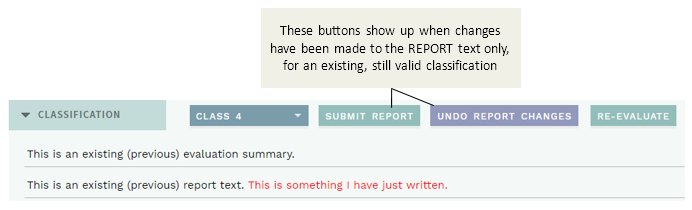
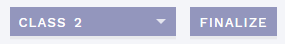

# Classification section: Summarize and set ACMG criteria and classification

[[toc]]

This section is where you review the information from other sections, summarize your findings, add ACMG criteria and set a classification. In other words, for variants with no pre-existing interpretation, you should review the other sections first. 

## Summarizing comments: Evaluation and Report

Unlike other sections, this section contains two main comment fields:

  - EVALUATION: For summarizing the evaluation of the consequence of the variant. This should be detailed enough for making an informed decision, but leaving the specifics to comments in respective sections.
  - REPORT: Comments relevant for clinical evaluation (automatically included in the final patient report). 
  ::: warning NOTE
  Comments made here will be visible for all patients where this variant shows up, and should be generalized, not patient-specific, as far as possible. For patient specific comments, use [fields on the REPORT page](/manual/report-page.html#comment-fields-indication-and-report).  
  ::: 

## Variants with a previous interpretation

ELLA matches the variants in each new sample with existing variant interpretations in the database, allowing reuse of any previous interpretation. 

### Variant classification and report history

If a previous interpretation is found, the last saved change to the classification/evaluation and/or report is displayed along with user and date in the EXISTING card:

Note that changes to the variant classification/evaluation and report fields are recorded independently (see [below](#update-submit-report-only)). Clicking the `HISTORY` button shows a more detailed history including ACMG criteria and comments, for every previously finalized round of interpretation or report change, ordered by date. Switch between `CLASSIFICATION` (default) and `REPORT` histories using the buttons, and use the dropdown for viewing the version saved at a specific time point: 

::: tip TIP
You can also view the history for a previously finished analysis (either finished workflow step or finalized) with all included variant interpretations; see [Analysis history](/manual/top-bar.html#analysis-history).
:::

### Interpretations that are still valid

Previously finalized variant interpretations have a limited time period where they are still considered valid, and can be re-used without further evaluation. These variants are grouped with CLASSIFIED VARIANTS in the [side bar](/manual/side-bar.html#side-bar-sections). 

Variant interpretations that are still valid are shown with a green background and automatically accepted as if you had performed a regular interpretation, but without resetting the validity period. 

It is still possible to do a re-evaluation of these variants by clicking the `RE-EVALUATE` button in the section banner (only available if the analysis/interpretation has been started). To undo any new interpretation (and avoid resetting the validity period), click the `UNDO RE-EVALUATION` button:

::: warning NOTE
Pushing the `RE-EVALUATION` button also resets the classification. To be able to finalize the variant, you must first reselect a class in the dropdown. 
:::

#### Update/submit REPORT only

In an analysis workflow, you may want to update the REPORT for a previously classified, still valid variant, without resetting the validity period. To do this, in an analysis that has already been started, make your changes to the REPORT field and push the `SUBMIT REPORT` button. Changes can be reverted with the `UNDO REPORT CHANGES` button (followed by `CONFIRM`): 

::: warning NOTES
Finalization is not possible if there are unsaved changes to a REPORT field (you will get an error message if you try). To correct this, either submit or undo the changes you made.

Also note that this feature is not intended for the VARIANTS workflow or for variants with outdated classifications. Although updating the REPORT this way is possible in these cases, other configured workflow requirements must also be fulfilled before you are allowed to finalize (e.g. mandatory REVIEW step, all variants classified).
:::

### Interpretations that are outdated

If a previous variant interpretation has exceeded the validity time period, it will be considered outdated and due for re-evaluation. 

Outdated variants are grouped with UNCLASSIFIED VARIANTS in the [side bar](/manual/side-bar.html#side-bar-sections). Unlike new variants (no previous interpretation in the database), however, you _must_ press the `RE-EVALUATE` button for outdated variants before you are able to update the interpretation. This is to avoid resetting the validity period if no actual re-evaluation has been performed.

## Review and add ACMG criteria 

The ACMG criteria in ELLA are based on the official [ACMG 2015 guidelines](https://pubmed.ncbi.nlm.nih.gov/25741868).

Before setting a variant classification, you should add relevant ACMG criteria to the variant interpretation. There are two main ways of doing this, from [suggested criteria](/manual/classification-section.html#suggested-acmg-criteria-and-requirements-req) or [manually](/manual/classification-section.html#add-acmg-criteria-manually), explained below. A third option is available for a few selected criteria in the [Quick classification mode](/manual/quick-classification.md).

Added criteria are shown in a list above the SUGGESTED card.

::: warning NOTE
Each ACMG criterion can be added only once for a particular variant, irrespective of chosen strength.
:::

### Suggested ACMG criteria and requirements (REQ)

ELLA automatically [suggests relevant ACMG criteria](/manual/acmg-rule-engine.html) based on a mapping of the variant annotation, as well as any information you have added manually, to these criteria. Suggested criteria are shown in the SUGGESTED card:

The specific requirements for each criterion are available by clicking on the label. The resulting pop-up also contains (where applicable):

  - Notes: From official [ACMG 2015 guidelines](https://pubmed.ncbi.nlm.nih.gov/25741868)
  - Local adjustments: Notes specific to your own setup
  - Match: What triggered the suggestion (this is still in development and may be somewhat cryptic or not available)

To add a suggested criterion to the interpretation, click `ADD` to the right. 

::: warning NOTE
The suggestions may be somewhat imprecise and **you should always check that all requirements are satisfied** before clicking `ADD`.
:::

#### REQ: requirements for ACMG criteria

Where possible, some of the ACMG criteria have been split into separate ["requirements" (REQs)](/manual/acmg-rule-engine.html#req-requirements) in ELLA. Each of these REQs is a necessary component for the ACMG criteria they belongs to. ELLA displays these REQs for information, which can be used as hints for additional criteria that may be relevant for the current variant. 

REQs that have a match in the current variant are shown when you click the `SHOW REQ` button:

### Add ACMG criteria manually

To add an ACMG criterion that is not already suggested by ELLA, press the `ADD ACMG` button in the top banner:

This brings up a side bar where you may modify strength, comment and add any ACMG criterion:

#### Other (non-ACMG) criteria

In addition to the official ACMG criteria, you can also add the generic `OTHER` criterion. This can be used for criteria that are not described in the ACMG guidelines, but that are nonetheless important for the clinical classification. This includes, e.g., certain gene-specific criteria from the ENIGMA and InSiGHT guidelines. Note that these will not be used in calculation of the [suggested classification](#set-variant-class).

## Modifying the strength of added criteria

To change the strength of a particular, added criterion, click either the `+` or `-` sign, for stronger or weaker evidence, respectively:

### Unweighted ACMG criterion 

If you click the `-` sign all the way, the criterion will be marked as `NOT WEIGHTED`. This can be used when the evaluation of a criterion needs to be documented, but where the evidence does not support using it in the final classification. Any criteria added this way will not be used in the [suggested classification](#set-variant-class). 

## Set variant class

Based on the particular ACMG criteria you have added, ELLA [suggests a classification](/manual/acmg-rule-engine.html#generating-suggestions), shown over the list of included ACMG criteria:

::: warning NOTES
Suggestions for classification are only made for Class 1-5, not the other choices below. Also note that ELLA's suggestion rules depart slightly from the original rules described in [Richards et al. 2015](https://www.nature.com/articles/gim201530), notably: 
- 1 `PVS` + >=1 `PM` = Class 5, not Class 4 (based on recommendations from Tavtigian (2018), ACGS (Ellard 2020) and CanVIG)
- \>=2 `PVS` = Class 5 (to account for modified strength of non-PVS1 criteria)
- 1 `PVS` + 1 `PP` = Class 4 (to account for logical gap)
:::

As with suggested criteria, you are free to ignore the suggestion, and you must always actively set a classification yourself before it takes effect. Once you have made a decision, select the corresponding class in the pull-down menu in the section bar:

The variant classification choices should be interpreted in line with [ClinVar's definitions](https://www.ncbi.nlm.nih.gov/clinvar/docs/clinsig/): 

Option  | Explanation
:--- | :---
`CLASS 1-5` | In accordance with [ACMG guidelines](https://pubmed.ncbi.nlm.nih.gov/25741868/).
`RISK FACTOR` | For variants that are interpreted not to cause a disorder but to increase the risk.
`DRUG RESPONSE` | For variants that affect a drug response, not a disease.
`NOT PROVIDED` | For recording various information (e.g. literature findings, research into functional significance, observed phenotypes) without interpreting clinical significance.

If in ANALYSES mode, making a classification selection moves the variant to CLASSIFIED VARIANTS in the variant side bar.

## Finalize variant

Once you have set a classification, you have the option to finalize the variant: 

Once a variant is finalized, the interpretation is made available to other users and will not generate [collision warnings](/manual/warnings.html#collision-warnings) if there are overlapping analyses. 

::: warning NOTES
- Depending on configuration, finalization of all new/updated classified variants may be a requirement to finalize the analysis. This includes any classifications that were set using [QUICK mode](/manual/quick-classification.md).
- Finalizing a variant should only be used when you consider the evaluation to be complete, i.e. no further review is needed. Depending on configuration, this option may therefore not be available except in review workflow steps.
- If you are in VARIANTS view (e.g. searched for and opened a specific variant), you must also change the workflow step to `FINALIZED` via the `FINISH` button in the top bar before the variant interpretation is considered truly finalized and workflow collision warnings are removed.
:::

