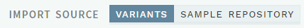
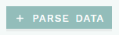
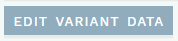
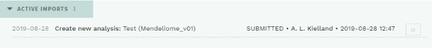
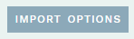
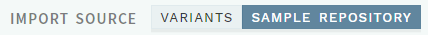
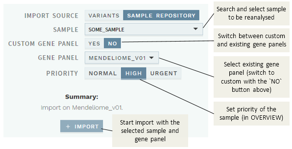
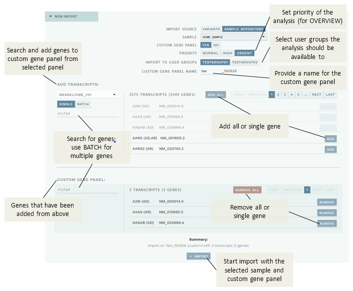
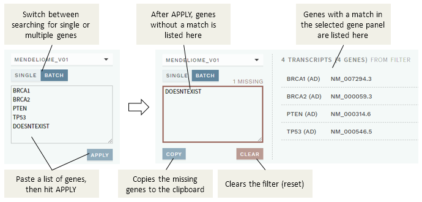

# Data import and reanalyses

[[toc]]

HTS data produced in-house is imported automatically into *ella*, with a gene panel predefined from the pipeline. However, [data for variants and samples can also be added manually](#import-variant-data), and the [gene panel for an existing sample can be changed](#custom-reanalyses-from-sample-repository). Both of these tasks can be performed through the `IMPORT` function available in the left, vertical sidebar:

## Overview: Import

The import page has the following sections:

  - ACTIVE IMPORTS: Imports currently being processed. Any failed imports are also listed here. 

  - IMPORT HISTORY: Previously imported variants/analyses. 
  - NEW IMPORT: Create a new data import or reanalysis.
    - Select `VARIANTS` (default) for importing variants as text/VCF  (optionally specifying analysis). See [Import variant data](#import-variant-data).
    - Select `SAMPLE REPOSITORY` for creating a new analysis (e.g. different gene panel) on a previously run sample. See [Custom reanalyses from sample repository](#custom-reanalyses-from-sample-repository).

## Import variant data

- In the NEW IMPORT section, select the `VARIANTS` option if not already the case: 

- Paste text containing the variants to be imported into the `PASTE VARIANT DATA HERE` field (see [supported import formats](#supported-import-formats)), then click `+ PARSE DATA`: 

- To go back and edit the import data, click the `EDIT VARIANT DATA` button (note that this will also reset any options selected): 

- See [options](#import-options) for configuring the import. When ready (and no warnings are displayed), click `+ IMPORT`: 

Submitted jobs are listed in the ACTIVE IMPORTS section:

If something went wrong, you can try the retry button to the right, or check for errors in the imported text (click anywhere on the import job text) and repeat the import process. 

The import job will be moved to the IMPORT HISTORY section with status DONE once the import has successfully completed.

### Supported import formats

Supported import data formats are explained in the list to the left of the input field;  Click on each list item for examples. 

::: danger WARNING
The import module is **not able to convert HGVS cDNA names for variants outside the transcribed region** of a given transcript (e.g. promoter variants), as this is considered invalid in terms of the HGVS format by the conversion service. 

To successfully import these variants, they must first be converted to **genome-based names**. 

Example: `NM_000321.2:c.-193T>G (het)` → `13-48877856-T-G (het)`  

Be careful when you do the conversion: If the transcript is reverse to the genome, you must use alleles that are complementary to the alleles given in the transcript!
:::

### Batch import

Results from multiple analyses may be imported at the same time by inserting a line before the results of each analysis in the pasted text, starting with "-" and followed by the analysis name. 

The contents of each original file is given its own import number and treated separately.

::: warning NOTE
Variants for the same sample must all be given in the same format. If you wish to import variants with multiple formats (e.g. HGVS cDNA and genomic) to the same sample, copy the sample header (starting with "-") to a new line and move any variants with a deviating format under it.
:::

### Import options

You may change parameters by clicking the `IMPORT OPTIONS` button (automatically opened if a warning: "Selection is incomplete" is displayed):

Depending on your data, the following options are available:

  - TYPE: `ANALYSIS`. Imports variants tied to an analysis ID and a gene panel. 
    
      - MODE: `CREATE`. Add a new sample (no match to existing analysis IDs).
      - MODE: `APPEND`. Append to an existing analysis ID with genotypes.
      - ANALYSIS NAME. Filled in automatically if provided in the pasted data, otherwise you must fill in (for CREATE) or choose an existing analysis.

  - TYPE: `VARIANTS`. Imports variants independently of analyses (samples). This is automatically chosen when one or more variants lack genotypes, and a warning message is displayed. 

  - GENE PANEL. Must be specified for all imports, to enable proper filtering. *ella* automatically chooses either the default panel (which you can change), or for MODE: `APPEND`, the panel matching the existing analysis ID (which you shouldn’t change unless you want to change to MODE: `CREATE`). 

  - TECHNOLOGY: `SANGER`/`HTS`. Default is `SANGER`, but you can change to HTS if importing from an external HTS service. 

::: warning NOTE
If you import variants (`APPEND`) to an analysis that is already opened by another user, *ella* displays a warning: "Analysis is ongoing. (\[user/date])!". 

The other user will then get a notification to refresh his/her browser upon next save, which will add any new variants to the ongoing analysis.
:::

You may also exclude individual variants from the import by deselecting them in the VARIANTS TO INCLUDE list to the right.

## Custom reanalyses from sample repository

By default, *ella* uses gene panels defined in the pipeline for all samples. However, you may also create a new analysis on a previously run sample (provided other genes were sequenced, e.g. exome/genome data) by using the `SAMPLE REPOSITORY` option in the NEW IMPORT section: 

### Use existing gene panel

The default reanalysis mode is to use an existing gene panel (CUSTOM GENE PANEL: `NO`):

To start a reanalysis: 

- Search and choose a sample name
- Choose a gene panel.
- Set the priority of the sample (for the OVERVIEW worklists)
- Click the `+ IMPORT` button to submit the import.

### Use custom gene panel

If you choose CUSTOM GENE PANEL: `YES`, you may instead add any combination of genes from existing gene panels:

To start a reanalysis with a custom gene panel for a chosen sample: 

  - Add a name for custom gene panel in the CUSTOM GENE PANEL NAME field. This should be max 12 characters, and you should avoid using the same name more than once per day to ensure a unique name.

  - In the ADD TRANSCRIPTS section: 
    - Select an existing gene panel. 
    - (Optional) [Filter genes to be added](#filter-genes-to-be-added).
    - Click `ADD ALL` to add all genes in the filtered list, or `ADD` next to a gene to add that particular gene only. Genes that have been added will be displayed in the CUSTOM GENE PANEL section and greyed out in the ADD TRANSCRIPTS list. 
    - Repeat the above if you need to choose from more than one existing gene panel. 

  - Once you are satisfied with the selection displayed in the CUSTOM GENE PANEL list, click the `+ IMPORT` button.

#### Filter genes to be added

If you do not want to use all genes in a selected gene panel, use the filter. 

##### Single genes

By default the `SINGLE` filter option is selected, which is useful for quickly locating a particular gene. Simply start typing a gene name in the FILTER box; this will filter the results to the right as you type. 

##### Multiple genes (batch)

You may also search for multiple genes in batch using the `BATCH` filter option: 

To use the batch filter: 

- Paste the genes you want to search for in the input field (both conventional gene names and HGNC IDs are supported; use any separator), then hit the `APPLY` button. 

- Genes that were found are listed to the right (and can then be added to the custom gene panel), whereas any genes not found will be listed in the input box. 

- (Optional) Use the `COPY` button to copy any missing genes to the clipboard, then the `CLEAR` button to reset the filter and start over. 

::: tip TIP
If a gene name doesn't work, try using the corresponding [HGNC ID](https://www.genenames.org/) instead.
:::

