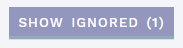

# Evidence sections: Evaluate annotation and studies

[[toc]]

In FULL (default) mode, the main view of the CLASSIFICATION page contains a number of different sections (shown here as [collapsed](http://manual/classification-page.html#use-collapsing-for-overview-and-marking-sections-as-done)):  

 

The different sections presenting annotation evidence are described below, see the separate page for the [Classification section](/manual/classification-section.md).

## Analysis specific (ANALYSES only)

This section is for information and actions specific to the variant as observed in the current sample (analysis), and displays indicators of the quality of the variant calling (HTS data, ANALYSES mode only).

::: warning Note
This is the only section on this page that is specific to the sample (analysis), all other sections are tied to the variant interpretation, which is independent of samples. This also means that any comments you add here will be visible in this analysis only.
:::

### Quality information 

Quality information is tied to a particular sample, and is therefore only available in ANALYSES mode. In addition, only information from HTS data is provided. The following quality parameters are shown (from the VCF file; see <https://software.broadinstitute.org/gatk/documentation/article.php?id=1268> for details):

  - Filter: PASS if all filters have passed, otherwise list filters that failed

  - Quality: Variant calling quality
    
      - Phred-scaled probability that a REF/ALT polymorphism exists at this site given sequencing data
      - 10 = 1 in 10 chance of error, 100 = 1 in 10^10 chance of error

  - GQ: Genotype quality
    
      - Derived from "Phred-scaled likelihood for genotype", which compares likelihood of possible genotypes
      - 99 is the maximum

  - Depth: Number of reads covering the site

  - Ratio: Number of reads covering each allele, with ratio for variant allele/total

Variants with quality issues are marked with NEEDS VERIFICATION in red in the QUALITY card. Note that indels are always marked, irrespective of other parameters.

### Mark as verified/technical/not relevant

In the header of the ANALYSIS SPECIFIC section, you can mark variants as `VERIFIED`, `TECHNICAL` or `NOT RELEVANT`:

  - `VERIFIED` means the variant has been verified by an independent method (e.g. Sanger) in this sample. This adds a green “V” tag in the “Q” column of the [side bar](/manual/side-bar.html#variant-tags).

  - `TECHNICAL` means the variant is a false variant call in this sample (analysis). This adds a red “T” tag in the “Q” column of the [side bar](/manual/side-bar.html#variant-tags) and moves the variant to the TECHNICAL VARIANTS [side bar section](/manual/side-bar.html#side-bar-sections).
  
  - `NOT RELEVANT` means the variant should be disregarded in this analysis, e.g. due to a mismatch with the phenotype. This moves the variant to the NOT RELEVANT VARIANTS [side bar section](/manual/side-bar.html#side-bar-sections).
  
::: tip Note 
Variants marked as `TECHNICAL` or `NOT RELEVANT` can, depending on the your configuration, be left without a selected class upon finalisation of the analysis.
:::

## Frequency

This section displays population frequencies reported in external or internal datasets (if any). Note that variants with a population frequency exceeding the threshold for ACMG criterion BA1 have already been [filtered out](/manual/top-bar.html#excluded-variants).

### Included Datasets

  - gnomAD exomes and genomes: <http://gnomad.broadinstitute.org/>
  - ExAC: <http://exac.broadinstitute.org/> (NB: partly deprecated, most samples are included in gnomAD)
  - InDB: OUSWES, in-house frequency database for sequenced exomes.
  - dbSNP: <https://www.ncbi.nlm.nih.gov/projects/SNP/>  
	::: warning Note
	Any SNP that has positional overlap with the current variant is reported, and therefore may not contain the exact same variant/allele. If you use this data, you should check the dbSNP entry to verify that it has the same variant as in your sample.
	:::

Variants with quality issues reported in gnomAD display a warning in the gnomAD cards.

### Mark as Class 2 variant

You may quickly set a class 2 for the current variant by pressing the `MARK CLASS 2` button in the header of this section:

This will move the variant to CLASSIFIED VARIANTS in the side bar.

## Prediction

This section displays various predicted effects of the variant.

### Included predictions

#### VEP consequence

[Variant Effect Predictor (VEP)](http://www.ensembl.org/info/genome/variation/predicted_data.html#consequences) provides basic information about the location and expected effect of a variant within a transcript and protein. VEP uses [Sequence Ontology terms](http://www.sequenceontology.org/).

By default, only effects in the default transcript(s) specified in the gene panel are shown. However, if there are worse consequences in other, alternative RefSeq (NM\_) transcripts, this will also be displayed together with a warning. To view consequences in all alternative RefSeq transcripts, click the given consequence(s).

### Add predictions

Add other types of predictions by clicking the `ADD PREDICTION` button:

The choices you make here are meant as “keywords”, and any details important for evaluating the choices made should always be added to the PREDICTION-COMMENTS field. Choices made here result in suggestions for relevant ACMG codes in the CLASSIFICATION section, but you still need to approve/add individual codes before final classification.

::: warning NOTE
The DOMAIN and REPEAT options are also available in the reference evaluation module (see below), and should be added there if you have a specific reference to attach this information to.
:::

The manual options are:

  - ORTHOLOG CONSERVATION
    
      - `CONSERVED`: the amino acid is highly conserved in orthologs
      - `NON-CONSERVED`: the amino acid is not conserved in orthologs

  - PARALOG CONSERVATION
    
      - `CONSERVED`: the amino acid is highly conserved in paralogs
      - `NON-CONSERVED`: the amino acid is not conserved in paralogs

  - DNA CONSERVATION
    
      - `CONSERVED`: the DNA nucleotide is highly conserved
      - `NON-CONSERVED`: the DNA nucleotide is not conserved

  - DOMAIN
    
      - `CRITICAL FUNCTIONAL DOMAIN`: the variant is located in a critical functional domain
      - `CRITICAL FUNCTIONAL AMINO ACID`: the function of the reference amino acid is known to be critical

  - REPEAT
    
      - `REPEAT REGION`: the variant is located in a repeat region.
      - `NON-REPEAT REGION`: the variant is located in a non-repeat region

  - SPLICE SITE EFFECT
    
      - `SPLICE SITE LOST`: the variant is predicted to cause the loss of an authentic splice site
      - `DE NOVO SPLICE SITE`: the variant is predicted to cause the creation of a novel splice site
      - `NO SPLICE SITE EFFECT`: the variant is predicted to have no effect on splicing

Remember to `SAVE` (top right) once you are done.

## External

This section shows annotation from external databases, currently including HGMD Pro and ClinVar.

### Included databases

  - HGMD Pro: <https://portal.biobase-international.com/hgmd/pro/>
  - ClinVar: <http://www.ncbi.nlm.nih.gov/clinvar/>

### Add data from other external databases

If you want to add results from other databases (various LSDBs, depending on the gene), press the `ADD EXTERNAL DB` button:

In the popup, select from the dropdown for each database you want to add from. For pre-specified databases, there will be a Visit database link to the right, which will take you to the corresponding database and gene. Choices for all databases except OTHER (which is free text) are:

  - Unambiguous classification: 
	  - **Pathogenic**: Class 5 or similar
	  - **Likely pathogenic**: Class 4 or similar
	  - **Uncertain significance**: Class 3 or similar
	  - **Likely benign**: Class 2 or similar
	  - **Benign**: Class 1 or similar

  - Other: 
	  - **Conflicting**: Conflicting classes reported
	  - **Indirectly relevant**: Variant is not the same, but has indirect relevance
	  - **Nothing found**: No entries found in database
	  - **Other**: None of the choices above are applicable

Remember to `SAVE` (top right) once you are done.

## Studies & references

This section contains literature references describing the selected variant. The references have been automatically retrieved from the annotation, but you can also [add studies](#add-studies) yourself. 

### Reference evaluation

Evaluate or ignore a reference by pressing one of the corresponding buttons:

::: tip TIP
Recurring, generic or otherwise irrelevant references from the annotation can automatically be ignored by [changing the configuration](/technical/uioptions.html#define-references-as-ignored) by a system administrator.
:::

When a choice/evaluation already has been made, the `EVALUATE` button changes to `RE-EVALUATE`.

The STUDIES-COMMENTS field at the top should be used for summarising findings and comments from the individual reference evaluation forms: 

#### Reference evaluation form

The `EVALUATE` button will bring up the reference evaluation form. Help text for the different options provided here is available by holding the mouse cursor over the header/question. 

The options in the form are meant as a guide, and you should always make a comment (at the bottom of the form) summarising any points from the reference that will be important for the classification of the variant. This comment is also visible in the reference list and can be directly edited here once an evaluation has been performed. 

#### Section cards

Evaluated/new references are placed in separate cards (only non-empty cards are shown): 

- EVALUATED: References marked with RELEVANCE: `YES` or `INDIRECTLY` in the evaluation form. 

- PENDING: New references (no evaluation has been performed).

- NOT RELEVANT: References marked with RELEVANCE: `NO` in the evaluation form. Note that this should only be used when the reference has actually been reviewed, but found not to contain relevant evidence.

- IGNORED: References marked with either the `IGNORE` button or RELEVANCE: `IGNORE` in the evaluation form. This card is hidden by default; To review, press the `SHOW IGNORED` button:

  

  These references may be added back by clicking the `RE-EVALUATE` button and changing to RELEVANCE: `YES` or `INDIRECTLY`.

### Add studies

If you have found other studies/references that aren’t already in the list, you can add them by clicking the `ADD STUDIES` button:

The resulting dialogue lets you add studies in one of three ways:

  - SEARCH: Search the internal database for studies that have already been added but not connected to the current variant, then click ADD next to a positive search result.
  
  - PUBMED: Add reference data as provided in PubMed XML format - see instructions in the pop-up.
  
  - MANUAL: Add studies manually, either PUBLISHED or UNPUBLISHED (e.g., in-house) studies. Fields marked with a \* are mandatory.
