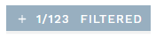
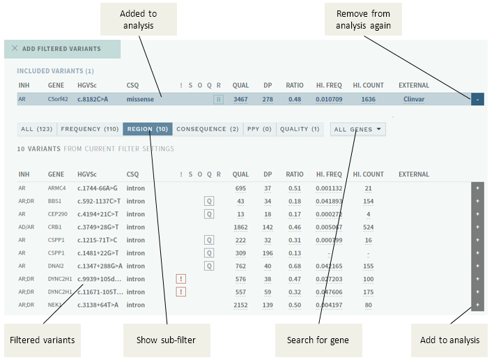

# Filtered variants

[[toc]]

Many variants have usually been automatically filtered from view before you start an analysis, based on [pre-configured rules](#filter-rules). These variants are still accessible via a button at the top of the variant list in the [side bar](/manual/side-bar.md): 

In this particular sample, there are a total of 123 filtered variants, and one of these have been added manually to the analysis by the user. 

Pushing the button brings up a window where you may select individual variants and add them to the analysis:

Pushing the `+` to the right of a variant adds the variant to the analysis, and will be shown in the side bar variant list with the `I` tag. 

The filter categories ("sub-filters" in the figure above) are defined in the configuration for your user group/gene panel, and each may consist of a combination of rules for filtering and "rescue". The left-most category (ALL) shows all filtered variants combined, whereas the other categories are applied in the left-right order displayed (i.e. in the example above, variants are filtered on frequency first, remaining are filtered by region, etc.).

## Filter rules

Most filter rules may be configured to filter or "rescue" (exclude from filtering) variants, or a combination of both. See [Technical documentation](/technical/filtering.html) for further details and [how to configure](/technical/filtering.html#available-filters-and-examples) the filters. 

Current rules include and use:

Label | Based on
:---|:---
CLASSIFICATION  | Existing classication in in-house database.
CONSEQUENCE | Predicted [consequences from VEP](https://www.ensembl.org/info/genome/variation/prediction/predicted_data.html).
EXTERNAL  | Reports/tags in external databases. 
FREQUENCY | Population frequency above a threshold, with options for minimum allele number, gene inheritance model and dataset groups.
INHERITANCE MODEL | Other variants/alleles in same gene in single samples, depending on inheritance model for gene. 
POLYPYRIMIDINE  | Variants in the intronic polypyrimidine tract.
QUALITY | Quality criteria not met. 
REGION  | Outside a defined UTR/intron region.
SEGREGATION | Segregation patterns in family data.