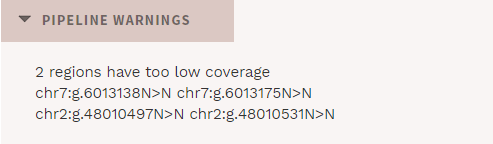
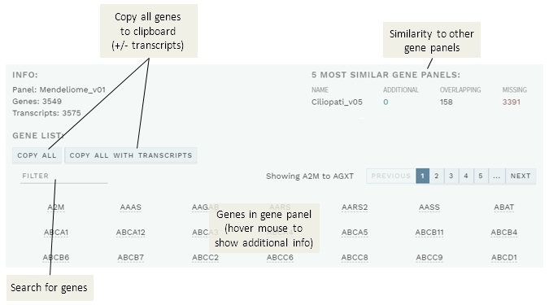

# Info page: Sample information

[[toc]]

If any warnings are generated by the HTS pipeline, clicking on an analysis in ANALYSES mode will take you to the INFO page first. You can also navigate to this page by clicking the `INFO` button in the left corner of the top bar:

## Pipeline warnings

A section with PIPELINE WARNINGS will be displayed in red if there are regions with low HTS coverage in the current run:

Note that these warnings can be turned off at any time using the [work log](/manual/top-bar.html#work-log). For further details about insufficiently covered regions, see the Pipeline report (described below).

## Analysis info

The ANALYSIS INFO section shows some basic information about the current sample. If the sample was run as part of a family, information about the other family samples will also be displayed here.

## Pipeline report

The PIPELINE REPORT section displays coverage details from the current HTS run, listing genes and regions with low coverage.

## Gene panel info

Information about the gene panel used for the current analysis is available via a button in the top bar (also available on the CLASSICATION and REPORT pages): 

Selecting this will bring up a pop-up showing the included genes: 

- Hover your mouse over a gene to show additional information (inheritance mode, indications and default transcript).

- Quickly search for a gene using the FILTER box.

- Copy all genes in the gene panel, with or without default transcripts, using the `COPY ALL`/`COPY ALL WITH TRANSCRIPTS` buttons.

- Also shown (top right) is the five most similar gene panels, with overlapping (equal), additional and missing genes. Note that this does not take into account any differences in default transcripts.  
