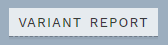
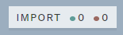
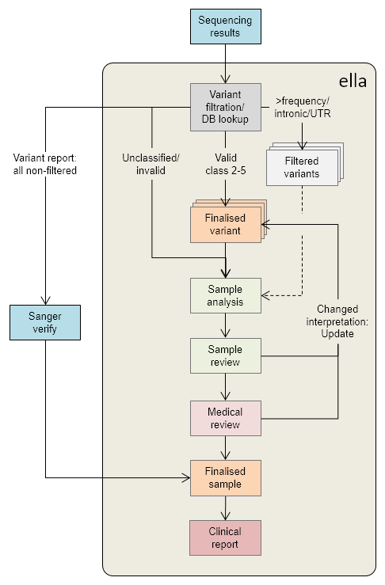
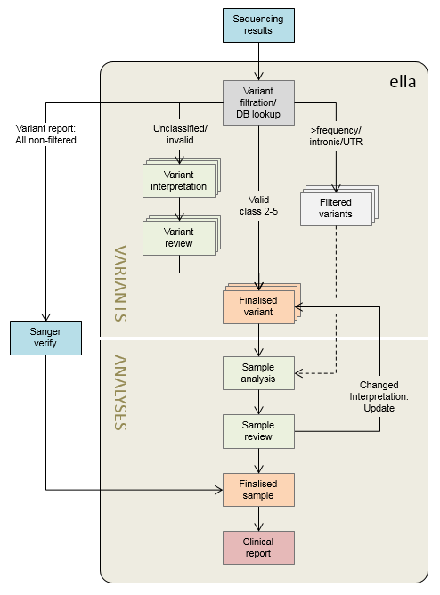
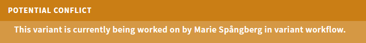

# OVERVIEW: Data and workflows 

[[toc]]

The first page you see after logging in is the OVERVIEW page. You can always navigate to this page using the link in the top right corner:

## Export report for Sanger verification

To quickly set up Sanger-verification of important variants, before the samples have been analysed, use the VARIANT REPORT button in the top right corner:

This generates an Excel-sheet that contains all analysis IDs and variants for samples that have not yet been started, along with import date, gene panel and any previously reported classification. The column sanger\_verify (TRUE/FALSE) uses the same criteria for Sanger verification as in *ella*.

## Data import and reanalyses

### Import data

HTS data produced in-house is imported automatically into *ella*. However, data for samples or individual variants can also be added manually by clicking on the IMPORT button in the top banner of the OVERVIEW page:

The numbers after the green and red dot in the button displays the number of import jobs that are currently being processed and that have failed processing, respectively.

Clicking the button brings up a pop-up window. Paste text containing the variants to be imported into the RAW DATA field, in one of the supported formats (see below), then click + PARSE DATA:

#### Supported import formats

Supported formats are explained in the list to the left of the RAW DATA field (click on each list item in *ella* to get more examples):

  - Full HGVS cDNA name (e.g. `NM_000059.3:c.9732_9733insA`)
  - Genomic position (e.g `13-32893435-G-T`)
  - VCF file
  - SeqPilot text export flie

::: danger
The import module is **not able to convert HGVS cDNA names for variants outside the transcribed region** of a given transcript (e.g. promoter variants), as this is considered invalid in terms of the HGVS format by the conversion service. 

To successfully import these variants, they must first be converted to **genome-based names**. 

Example: `NM\_000321.2:c.-193T>G (het)` → `13-48877856-T-G (het)`.  

Be careful when you do the conversion: If the transcript is reverse to the genome, you must use alleles that are complementary to the alleles given in the transcript!
:::

#### Batch import

Results from multiple analyses may be imported at the same time by inserting a line before the results of each analysis in the pasted text, starting with “-“ and followed by the analysis name. 

The contents of each original file is given its own import number and treated separately.

::: warning NOTE
Variants for the same sample must all be given in the same format. If you wish to import variants with multiple formats (e.g. HGVS cDNA and genomic) to the same sample, copy the sample header (starting with “-“) to a new line and move any variants with a deviating format under it.
:::

#### Options

You may change parameters by clicking the EDIT IMPORT button (if a warning: “Selection is incomplete” is displayed, the dialogue is automatically opened):

Depending on your data, the following options are available:

  - TYPE: ANALYSIS. Imports variants tied to an analysis ID and a gene panel.
    
      - MODE: CREATE. Add a new sample (no match to existing analysis IDs).
      - MODE: APPEND. Append to an existing analysis ID with genotypes. \*
      - ANALYSIS NAME. Filled in automatically if provided in the pasted data, otherwise you must fill in (for CREATE) or choose an existing analysis.

  - TYPE: VARIANTS. Imports variants independently of analyses (samples). This is automatically chosen when one or more variants lack genotypes, and a warning message is displayed.

  - GENEPANEL. Must be specified for all imports, to enable proper filtering. *ella* automatically chooses either the default panel (which you can change), or for MODE: APPEND, the panel matching the existing analysis ID (which you shouldn’t change unless you want to change to MODE: CREATE).

  - TECHNOLOGY: SANGER/HTS. Default is SANGER, but you can change to HTS if importing from an external HTS service.

::: warning NOTE
If you import variants (APPEND) to an analysis that is already opened by another user, *ella* displays a warning: "Analysis is ongoing. (\[user/date])!". 

The other user will then get a notification to refresh his/her browser upon next save, which will add any new variants to the ongoing analysis.
:::

You may also exclude individual variants from the import by deselecting them in the VARIANTS TO INCLUDE list to the right.

Once satisfied, click the + IMPORT button:

Submitted jobs are displayed at the top of the import pop-up:

The status will change from SUBMITTED to DONE once the import has successfully completed. If something went wrong, you can try the retry button to the right, or check for errors in the imported text (click the STATUS text) and repeat the import process.

### Reanalyses and custom gene panels

By default, *ella* uses predefined gene panels for all samples. However, you may create a new analysis of a previously run HTS sample (for which a larger set of genes was sequenced) using the IMPORT function available in the vertical sidebar:

In the IMPORT ANALYSIS section, start typing the analysis ID in the SAMPLE box and select from the results.

#### Use existing gene panel

If you use the default NO for CUSTOM GENEPANEL, only existing (standard) gene panels are shown:

  - Select the desired gene panel from the GENEPANEL list (1).

  - Once you are satisfied with the selection displayed in the “Summary” at the bottom, click the + IMPORT button (2) to import.

#### Use custom gene panel

If you choose YES for CUSTOM GENEPANEL, you may add any combination of genes from existing gene panels:

  - Add a name in the CUSTOM GENEPANEL NAME field (1) (max 12 characters, do not use the same name more than once per day to ensure a unique name)

  - Add genes by selecting an existing gene panel (2) under ADD TRANSCRIPTS, then click
    
      - ADD ALL (3) to add all genes in the selected gene panel, or
      - ADD (4; next to a gene) to add that particular gene only. Start typing a gene name in the FILTER box (5) to quickly locate a gene in the list. Genes that have already been added are greyed out.

  - Repeat the above if you need to choose from more than one existing gene panel. 
	:::tip 
	Select a large gene panel, e.g. "OMIM" to get all available genes.
	:::

  - Once you are satisfied with the selection displayed in the ADDED list at the bottom (6), click the + IMPORT button to import.

## Workflows

*ella* allows both interpretation of individual [VARIANTS](#variant-centered-workflow-variants) (independent of laboratory samples), and [ANALYSES](#sample-centered-workflow-analyses) of variants in the context of a sample and a pre-specified gene panel. The most important difference is that the VARIANTS workflow does not show any sample-specific information/functionality, which includes:

  - Genotype
  - Quality of the variant call (read depth, allele balance, mapping quality, etc.)
  - Genotyping method (e.g. HTS or Sanger)
  - Sample(s) information
  - Other variants in the same sample
  - Possibility for generating a clinical report

Which workflow is either preselected for your user/unit or selectable via the vertical buttons in the left margin of the OVERVIEW page:

Most users will default to [ANALYSES](#sample-centered-workflow-analyses) as this is the only workflow that allows completion of samples. However, in certain cases (typically high sample volume, small gene panels, multiple collaborating users) the [VARIANTS](#variant-centered-workflow-variants) workflow may be preferred. You may also go directly to a variant or analysis by using the [search function](#search-and-edit-variants-and-samples).

### Date, user and Tags

For both ANALYSES and VARIANTS view, each analysis/variant is marked with the date when the sample/variant was loaded into ella (sorted with oldest on top) and, if present, user and date of previous interpretation rounds along with any [overview comments](/manual/top-bar.html#work-log) provided by the previous analyst. In addition, in the ANALYSES view, samples are marked with the source of the data (HTS or SANGER, or both), as well as a [WARNING](/manual/info-page.html#pipeline-warnings) if relevant:

### Sample-centered workflow: ANALYSES

An ANALYSIS is tied to both a specific laboratory sample and a gene panel. Note that this means that, although rare, the same patient may be present in multiple analyses. In these instances, each analysis is treated separately, and it is not possible to merge results. 

In the ANALYSES view, you may choose from one or more of the following:

  - NOT READY: Imported analyses where a variant needs validation or regions are insufficiently covered. The variants in these samples should not be interpreted until validation/sequencing of missing regions has been performed.
  - YOUR ANALYSES: Any unfinished analyses that you have started and saved, but not completed.

**New analyses (ready for interpretation)**

  - WITH FINDINGS: CLASS 3-5: Samples that have at least one variant previously classified as class 3, 4 or 5.
  - ONLY NORMAL: CLASS 1-2 + U: Samples where all variants have been classified as Class 1, 2 or U.
  - MISSING CLASSIFICATIONS: Samples that have not yet been opened/analysed and where there are no previously classified class 3-5 variants.

**Analyses pending review** 

Samples that have been analysed at least once and that have been marked for review (users and dates for previous analyses are given to the far right):

  - PENDING REVIEW - WITH FINDINGS: CLASS 3-5: Samples that have at least one variant previously classified as class 3, 4 or 5.
  - PENDING REVIEW - ONLY NORMAL: CLASS 1-2 + U: Samples where all variants have been classified as Class 1, 2 or U.
  - PENDING REVIEW - MISSING CLASSIFICATIONS: Samples that have not yet been opened/analysed and where there are no previously classified class 3-5 variants.
  - PENDING MEDICAL REVIEW: Samples pending review by a lab physician.

**Finished/reserved analyses**

  - OTHERS’ ANALYSES: Samples currently being worked on by other users.
  - FINALISED: Samples that have been analysed and marked as Finalised.

A schematic representation of a possible workflow that starts with ANALYSES is shown in **Figure 1**.

**Figure 1:** Sample-centred workflow. Valid classifications are defined as \<6 month old. ”Sample review” is optional, and may be omitted for low-complexity samples (e.g. only benign variants and/or still valid existing classifications).

### Variant-centered workflow: VARIANTS

An alternative, more complex workflow starting with a VARIANTS workflow followed by ANALYSES is presented in **Figure 2**.

**Figure 2:** Variant-centred workflow followed by sample analysis

This workflow is particularly well suited for small gene panels and high sample volumes, where a group of analysts collaborate on the same set of samples and variants. 

In the VARIANTS view, you may choose from one or more of the following:

  - YOUR VARIANTS: Any unfinished variant interpretations that you have started and saved from a previous session.
  - PENDING CLASSIFICATION: Variants that have not yet been opened/interpreted.
  - PENDING REVIEW: Variants that have been interpreted at least once and that have been marked for review. Users and dates for previous interpretations are given to the far right.
  - OTHERS’ VARIANTS: Variants currently being worked on by other users.
  - FINALISED: Variants that have been interpreted and marked as Finalised.

::: warning NOTE
Variants that have first been started in ANALYSES mode are not visible in VARIANTS mode. Moreover, variants that have been finalised in ANALYSES mode first are not visible under FINISHED variants in VARIANTS mode. It is therefore recommended to always follow the workflow in **Figure 2** above when using VARIANTS mode.
:::

## Search (and edit) variants and samples

To search for a particular variant or analysis (past or present), use the search section at the top of the OVERVIEW page:

Possible searches include HGVS cDNA or protein variant name with or without reference ID, genomic position/range and analysis ID. Examples:

  - `c.198A>G`
  - `NP_075561.3:p.Gly1248Asp`
  - `13:32890607`
  - `13:32890500-32890800`
  - `NA12878`

Search results may be narrowed further by selecting gene or user, or by ignoring excluded variants (see figure above).

Clicking on a variant search result will open the variant in a [VARIANTS workflow](/manual/overview-page.html#variant-centered-workflow-variants). Note that to (re-)interpret the variant, *ella* has to tie the interpretation to a gene panel. Check that the correct gene panel is chosen in the dropdown next to the START button, *before* you press START:

## Collision warnings: Same variant - Multiple users

If you open a variant or analysis that overlaps with (unfiltered) variants currently opened by other users, *ella* displays a red warning banner at the bottom. For the warning below, the analysis contains one variant currently being worked on in VARIANT workflows by the user Bjørnstjerne Bjørnson:

This means that variant interpretation changes made by the other user may overwrite your own changes, or vice versa. You should therefore wait until the other user is finished, or clarify with the other user if you should do the interpretation for these variants. Note that, if you open a variant that is under the OTHERS’ VARIANTS header in a VARIANTS workflow, you can choose to reassign the variant or analysis to yourself by using the REASSIGN TO ME button top right:

Similarly, if another user imports new results to an analysis you have already opened, a warning will be displayed upon next save or if you try to finish the analysis: ADDITIONAL DATA HAVE BEEN ADDED TO THIS ANALYSIS. PLEASE REFRESH. In this case, simply refresh your browser (Ctrl + R), which will add the new variants to the analysis.

## User profile and history

By clicking your user name, you will get an overview of your profile and interpretation history. Clicking on a variant/sample under YOUR ACTIVITY will open that variant/sample.

This page also includes a LOGOUT button (top right), but the use of this should usually not be necessary in TSD.

::: warning NOTE
Checking the user history will exit any currently active interpretation, so remember to save your work first!
:::