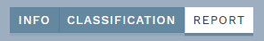
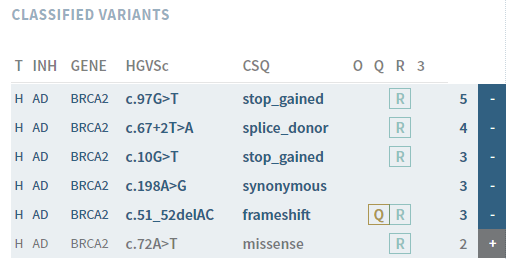

# REPORT: Generate a clinical report

The report page lets you export variants using using standard naming conventions together with the classification, as well as any comments you added to the REPORT field in the CLASSIFICATION section. NB: Currently, this *must* be done before marking the sample as finalised (see below).

To make a report, click the REPORT button in the top bar:

Variants classified as Class 3, 4 or 5 are automatically added to the report and marked with a - sign in the side bar. Not included variants are marked with a + sign. If you want to remove or add additional variants, simply click anywhere on the variant in the list.

Once you are satisfied, copy the text generated in the REPORT field. You may also add a REPORT COMMENT, which is meant for comments relevant for the sample as a whole (including all variants), such as any clinical or phenotypic considerations that may influence the prior likelihood of pathogenicity for particular variants.