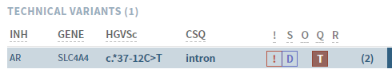

# Side bar: Variant list (ANALYSES only)

[[toc]]

The variants in your sample (ANALYSES mode) are listed to the left:

Names (variant HGVSc and gene) and inheritance is displayed as specified by the default transcript in the gene panel. If there is more than one default transcript, all versions are shown.

Variants marked as TECHNICAL is moved to a separate section at the bottom:

## Variant tags

If applicable, variants in the variant list are tagged with:

  - \!: [Variant warnings](/manual/top-bar.html#variant-warnings)

  - S: Segregation. Depdending on data, changes to:
    
      - D: de novo
      - A: Autosomal recessive homozygous
      - X: X-linked recessive
      - C: Compound heterozygous

  - O: Homozygous/hemizygous genotype

  - Q: Quality issues (= [NEEDS VERIFICATION](/manual/evidence-sections.html#quality-information)). Depending on actions in the [QUALITY section](/manual/evidence-sections.html#quality), this tag may be replaced by:
    
      - V = Verified (green)
      - T = Technical (red)

  - R: Reference available

  - Shaded background: More than one variant in the same gene (in current sample)

::: tip
Hold the mouse cursor over a tag to see the full label.
:::

## Sorting

The default sorting of this list is Inheritance – Gene – HGVSc. You can change the sorting by clicking on any of the list headers:

  - First click sorts descending (↓)
  - Second click sorts ascending (↑)
  - Third click returns to default sort

As you analyse variants in this list, they are moved from UNCLASSIFIED VARIANTS to CLASSIFIED VARIANTS, and marked with the classification given. Variants already classified in the internal database are automatically added to the classified part, and marked with a \* after the classification if outdated.

::: warning NOTE
Outdated variants marked with \* in CLASSIFIED VARIANTS must be re-interpreted before you are allowed to finish the analysis.
:::