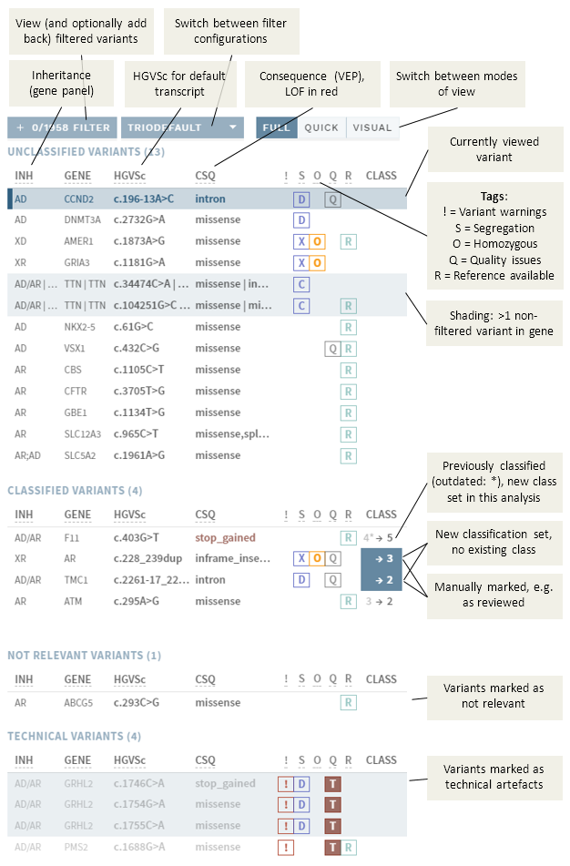
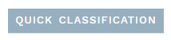
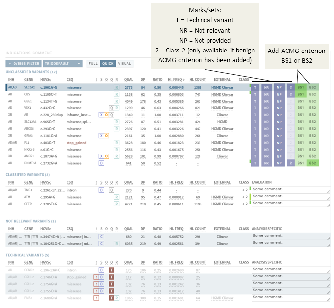
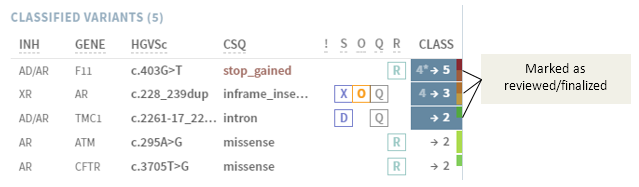

# Side bar: Variant list and quick classification

[[toc]]

The variants in your sample (ANALYSES mode only) are listed in the side bar to the left:

Names (variant HGVSc and gene) and inheritance is displayed as specified by the default transcript in the gene panel. If there is more than one default transcript, all versions are shown.

## Buttons

Button  | Explanation | More information
:---  | :---  | :---
`FILTERED`  | View and optionally add back filtered variants. | [Filtered variants](/manual/filtered-variants.md)
[Drop-down menu]  | Switch between filter configurations (pre-defined)  | Filtered variants](/manual/filtered-variants.md)
`QUICK CLASSIFICATION`  | System and user messages related to current analysis/interpretation. |  [Quick classification](#quick-classification)

## Variant tags

If applicable, variants in the variant list are tagged with:

  - `!` See [Variant warnings](/manual/top-bar.html#variant-warnings).

  - `S` Segregation. Depdending on data, changes to:
    
      - `D` De novo
      - `A` Autosomal recessive homozygous
      - `X` X-linked recessive
      - `C` Compound heterozygous

  - `O` Homozygous/hemizygous genotype

  - `Q` Quality issues. Same as [NEEDS VERIFICATION](/manual/evidence-sections.html#quality-information), except that indels are not marked unless there is other issues. Depending on actions in the [QUALITY section](/manual/evidence-sections.html#quality), this tag may be replaced by:
    
      - `V` Verified (green)
      - `T` Technical (red)

  - `R` Reference available

  - Shaded background: More than one variant in the same gene (in current sample).

::: tip
Hold the mouse cursor over a tag to see the full label.
:::

## Quick classification

Instead of performing a full classification, you may instead choose the Quick classification mode by pressing the button at the top of the variant list: 

This feature is particularly well suited for workflows with large gene panels and many variants. The Quick classification view gives a summary of the most important information necessary for [marking variants](/manual/evidence-sections.html#mark-as-verified-technical-not-relevant) as `TECHNICAL` or `NOT RELEVANT`, or [classifying](/manual/classification-section.html#set-variant-class) as `CLASS U` or `CLASS 2`, and gives you buttons to perform those actions directly:

 

Clicking one of these buttons moves the variant down to the respective section in the sidebar. If applicable, add a comment before moving to the next variant; this will be added to the comment field on the CLASSIFICATION page corresponding to the column header (e.g. ANALYSIS SPECIFIC).

When you are done, and ready to do a more thourough interpretation of any remaining variants, click the `FULL CLASSIFICATION` button at the top of the variant list (see also [Evidence sections](/manual/evidence-sections.html) and [Classification section](/manual/classification-section.html))

## Sorting

The default sorting of this list is Inheritance – Gene – HGVSc. You can change the sorting by clicking on any of the list headers (also in [Quick classification](#quick-classification)):

  - First click sorts descending (↓)
  - Second click sorts ascending (↑)
  - Third click returns to default sort

## Existing and new classifications  

Existing or newly set classes are given in the right-most column: 

An arrow (→) indicates that a new classification will be created, and any existing class is given to the left of the arrow. If this classification is also outdated (long since last interpretation), an `*` is added to the existing class.

::: warning NOTE
Outdated variants marked with `*` in CLASSIFIED VARIANTS should be re-interpreted before you finish the analysis.
:::

## Mark as reviewed

You can toggle a blue colouring of the background of the class by clicking on it in the side bar: 

This can be used to indicates which variants have been reviewed, i.e. to keep track of the work done in a review round. 
