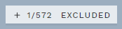
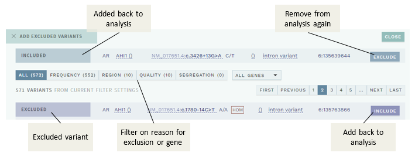
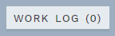
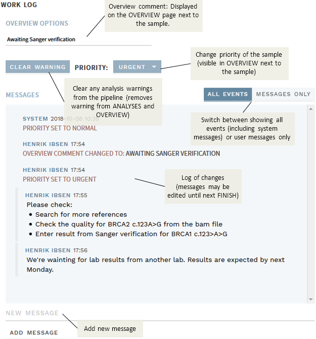
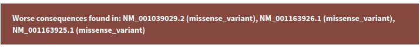

# Top bar: Info and actions

[[toc]]

The top bar contains information about the current user, selected variant, as well as action button. The figure below shows the top bar in the ANALYSIS workflow, where there are three sections, for global, analysis and variant-specific information/actions, respectively:

The view in VARIANTS workflow is almost the same but contains no sample-specific information.

::: warning NOTE
When you have selected a variant or sample, no changes are possible or saved before you press the START … button in the upper right corner. This commits the sample/variant (depending on chosen workflow) to you, and marks it as ongoing (“Others’ analyses/variants”) to other users.
:::

## Excluded variants

Some variants have been automatically filtered from view before you start an analysis. These variants are still accessible via a button in the upper right corner:

In this particular sample, there are a total of 572 filtered variants, one of these has manually been added back to the analysis by the user. Pushing the button brings up a window where you may select individual variants and add them back to the analysis:

Excluded variants include, in this order:

  - FREQUENCY: Variants with a population frequency above the threshold for neutral variants (ACMG criterion BA1), predefined for the corresponding gene in the gene panel

  - REGION: UTR variants outside c.-20/c\*20, intron variants outside +6/-20, and other, custom regions defined outside the scope of analysis. Variants are not excluded if they are annotated with a “worse” consequence than UTR/intron in an alternative RefSeq NM\_ transcript for that gene.

  - QUALITY: Variants not meeting minimum quality criteria (if set).

  - SEGREGATION: Relevant for trio/family data only (joint called). This includes variants that are *not*:
    
      - De novo
      - Autosomal recessive homozygous
      - X-linked recessive
      - Compound heterozygous

## Analysis history for previously finished samples

When a previously analysed sample is opened in ANALYSES mode, a drop-down menu in the top bar (right) provides an option for viewing the exact state at an earlier, finished step (review or finalize):

This shows all variant interpretations as well as the annotation available at the selected time. Note that if you click REOPEN (button the right of the drop-down) for a finalized sample, the annotation and variant interpretations shown are always equal to the most current state.

::: warning NOTE
This history view is specific to analyses performed in [ANALYSES mode](/manual/overview-page.html#sample-centered-workflow-analyses) and does not include history of independent variant interpretations performed in [VARIANTS mode](/manual/overview-page.html#variant-centered-workflow-variants) (if any). See also [variant-specific classification histories](/manual/classification-section.html#variants-with-a-previous-interpretation).
:::

## Work log

Both the ANALYSES and VARIANTS workflows have their own work log, which can be accessed with the button in the top right corner:

If there are any messages since last time the workflow was finalised, the work log button will appear in purple, along with the current message count.

Overview and example work log:

The work log lets you:

  - Leave an OVERVIEW comment: Consider this before sending a variant interpretation or sample to review. This comment will be displayed on the overview page alongside the variant or sample and your user name, and is useful for short workflow-related messages about the sample/variant (e.g., “Should be reviewed by an expert on this gene.”).

  - Clear any analysis warnings (ANALYSES workflow only). Clearing a warning makes the warning tag disappear from the OVERVIEW and will take the next user directly to the CLASSIFICATION page (instead of the INFO page).

  - Manually adjust the priority of the analysis or variant (affects sorting on the OVERVIEW page, with high priority on top).

  - Add messages (think “sticky notes”) that should be available to yourself or later interpreters about things that are relevant for the interpretation of the analysis or variant. Messages can contain formatting and images, and are editable until the next interpretation round is started.

Note that adding messages or changing priority is possible at any time, without having to start a new interpretation round.

## Variant warnings

Variants are tagged with warnings whenever there is something special that considered for the variant in question. The list of warnings currently includes:

  - Worse consequences in other transcripts
  - Other variants are within 3 bp of the variant in the analysis

Variant warnings are implemented for both the variant and analysis workflows, but some warnings are only available for analyses.

Example warning:

