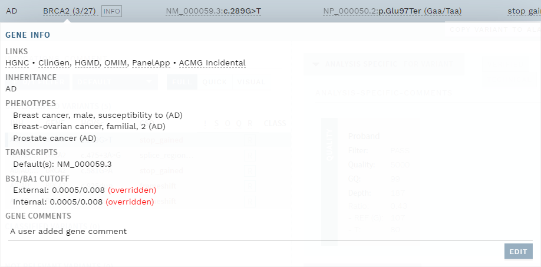

# Top bar: Info and actions

[[toc]]

The top bar contains information about the current user, selected variant, as well as action buttons. The figure below shows the top bar in the ANALYSIS workflow, where there are three sections, for global and variant-specific information/actions, respectively:

The view in VARIANTS workflow is almost the same but contains no sample-specific information.

::: warning NOTE
If available, the RefSeq transcript and version used in the HGVSc variant name in the top bar (NM_175629.2 in the example above) matches what is specified in the gene panel. However: 
- If the same transcript version is not found, the newest version available in the annotation is used. 
- If no matching transcript reference is found (regardless of version), all available transcripts are shown.
:::

## Action buttons

Various action buttons are available in the top bar, divided by Global actions (middle section) and Variant actions (specific for the chosen variant). 

### Global

Button  | Explanation | More information
:---  | :---  | :---
`GENE PANEL INFO` | Show information about the gene panel used in the current analysis. | [Gene panel info](/manual/info-page.html#gene-panel-info)
`WORK LOG`  | System and user messages related to current analysis/interpretation. The number of user added messages is shown in parentheses. |  [Work log](/manual/worklog.md)
`START` /  `FINISH`+`SAVE` | Start, save changes and finish an analysis or interpretation. | [Start](/manual/classification-page.html#start-an-analysis-or-interpretation); [Save/Finish](/manual/classification-page.html#save-and-finish)

### Variant

Button  | Explanation | More information
:---  | :---  | :---
`COPY VARIANT TO ALAMUT`  | Copy currently selected variant to clipboard in Alamut format.  | [Links](/manual/classification-page.html#links-to-the-web-and-alamut)
`ADD ACMG`  | Add an ACMG criterion manually. | [Classification section](/manual/classification-section.html#add-acmg-criterion-manually)
`ADD ATTACHMENT`  | Add an attachment (picture or file) to a comment field. | [Comments and attachments](/manual/classification-page.html#comments-and-attachments)
`COLLAPSE ALL`  | Collapse all evidence sections. | [Use collapsing for overview ...](/manual/classification-page.html#use-collapsing-for-overview-and-marking-sections-as-done)

## Gene information

Clicking on the gene name in the top bar gives you extended information about the particular gene:

Header  | Explanation | More information
:---  | :---  | :---
LINKS | Click to go to corresponding gene information pages from external resources. 
INHERITANCE | Inheritance mode, specified in the gene panel. | [Gene panels](/technical/genepanels.html#gene-panels)
PHENOTYPES | Associated phenotypes, specified in the gene panel. | [Gene panels](/technical/genepanels.html#gene-panels)
BS1/BA1 CUTOFF | Frequency thresholds for automatic suggestions of the corresponding ACMG-AMP criteria (divided by external and internal database). | [User group-specific ACMG rules](/technical/acmg.html#user-group-rules)
GENE COMMENTS | User-added gene information. | (see below)

The GENE COMMENTS field is editable; click the `EDIT` button and `UPDATE` when you have made changes. This can be done even if the analysis itself has not been started. If a comment has been added, an `INFO` tag is shown next to the gene name. 

::: warning NOTE
In the current iteration, no collision warnings will be shown if another user is editing the information at the same time, and there is a risk for overwriting each other's work if this happens. 
:::

## Analysis history for previously finalized samples

When a previously finalized sample is opened, all variants are shown with the variant interpretations, classifications and annotation available at the time of the last finalized interpretation round. As this may differ from the current state (especially if the interpretation was done a long time ago), a warning about historical data is given. To instead view current data, or any previous interpretation rounds (including non-finalized steps), use the drop-down menu in the top bar (right):

Note that if you click `REOPEN` (button the right of the drop-down) for a finalized sample, the annotation and variant interpretations shown are always equal to the most current state.

::: warning NOTE
This history view is specific to analyses performed in [ANALYSES mode](/manual/workflows.html#analyses-workflow-for-samples) and does not include history of independent variant interpretations performed in [VARIANTS mode](/manual/workflows.html#variants-workflow-for-independent-variants) (if any). See also [variant-specific classification histories](/manual/classification-section.html#variants-with-a-previous-interpretation).
:::

## User profile and history

By clicking your user name (top right corner), you will get an overview of your profile and interpretation history. Clicking on a variant/sample under YOUR ACTIVITY will open that variant/sample.

This page also includes a `LOGOUT` button (top right).

::: warning NOTE
Checking the user history will exit any currently active interpretation, so remember to save your work first!
:::