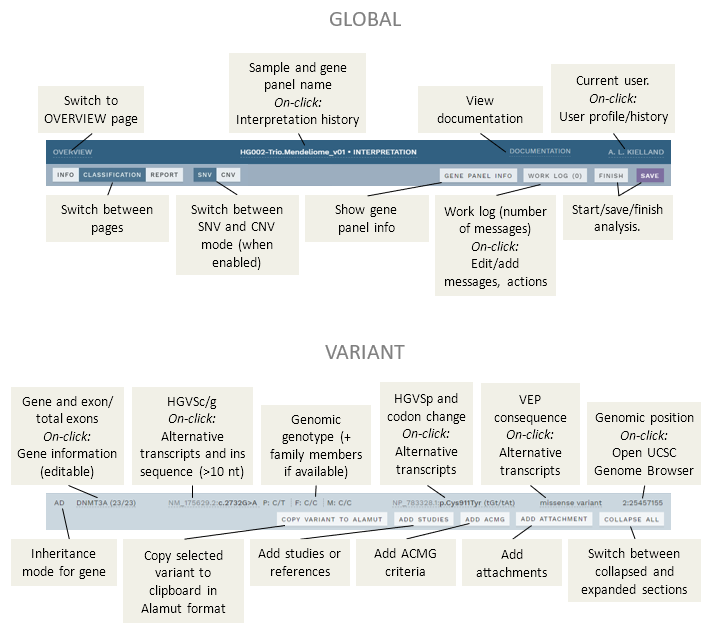
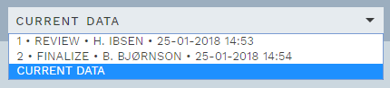

# Top bar: Info and actions

[[toc]]

The top bar contains information about the current user, selected variant, as well as action buttons. The figure below shows the top bar in the ANALYSIS workflow, where there are three sections, for global and variant-specific information/actions, respectively:

The view in VARIANTS workflow is almost the same but contains no sample-specific information.

::: warning NOTE
If available, the RefSeq transcript and version used in the HGVSc variant name in the top bar (NM_175629.2 in the example above) matches what is specified in the gene panel. However: 
- If the same transcript version is not found, the newest version available in the annotation is used. 
- If no matching transcript reference is found (regardless of version), all available transcripts are shown.
:::

## Action buttons

### Global

Button  | Explanation | More information
:---  | :---  | :---
`GENE PANEL INFO` | Show information about the gene panel used in the current analysis. | [Gene panel info](/manual/info-page.html#gene-panel-info)
`WORK LOG`  | System and user messages related to current analysis/interpretation. |  [Work log](/manual/worklog.md)
`START` /  `FINISH`+`SAVE` | Start, save changes and finish an analysis or interpretation. | [Start](/manual/classification-page.html#start-an-analysis-or-interpretation); [Save/Finish](/manual/classification-page.html#save-and-finish)

### Variant

Button  | Explanation | More information
:---  | :---  | :---
`COPY VARIANT TO ALAMUT`  | Copy currently selected variant to clipboard in Alamut format.  | [Links](/manual/classification-page.html#links-to-the-web-and-alamut)
`ADD ACMG`  | Add an ACMG criterion manually. | [Classification section](/manual/classification-section.html#add-acmg-criterion-manually)
`ADD ATTACHMENT`  | Add an attachment (picture or file) to a comment field. | [Comments and attachments](/manual/classification-page.html#comments-and-attachments)
`COLLAPSE ALL`  | Collapse all evidence sections. | [Use collapsing for overview ...](/manual/classification-page.html#use-collapsing-for-overview-and-marking-sections-as-done)

## Analysis history for previously finished samples

When a previously analysed sample is opened in ANALYSES mode, a drop-down menu in the top bar (right) provides an option for viewing the exact state at an earlier, finished step (review or finalize):

This shows all variant interpretations as well as the annotation available at the selected time. Note that if you click `REOPEN` (button the right of the drop-down) for a finalized sample, the annotation and variant interpretations shown are always equal to the most current state.

::: warning NOTE
This history view is specific to analyses performed in [ANALYSES mode](/manual/workflows.html#sample-centered-workflow-analyses) and does not include history of independent variant interpretations performed in [VARIANTS mode](/manual/workflows.html#variant-centered-workflow-variants) (if any). See also [variant-specific classification histories](/manual/classification-section.html#variants-with-a-previous-interpretation).
:::

## User profile and history

By clicking your user name (top right corner), you will get an overview of your profile and interpretation history. Clicking on a variant/sample under YOUR ACTIVITY will open that variant/sample.

This page also includes a `LOGOUT` button (top right).

::: warning NOTE
Checking the user history will exit any currently active interpretation, so remember to save your work first!
:::