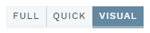

# Visual mode

[[toc]]

Pushing the `VISUAL` button (available in ANALYSIS mode only) in the side bar opens the VISUAL mode:

 

This mode features an [integrated version](https://igv.org/doc/doc.html) of [Integrative Genomics Viewer (IGV)](http://software.broadinstitute.org/software/igv/):

With IGV, you can visualize all variants in an analysis, along with customisable tracks at three different levels: global, user group or analysis.

## Global tracks

Global tracks are available to all users. These currently include: 

- `REFGENE`: Transcripts from RefGene.
- `GENEPANEL`: Regions covered by the current gene panel.
- `VARIANTS`: All variants in the same sample (analysis) _after_ filtering.
- `CLASSIFICATIONS`: All existing classifications present in the database.
	
## Your tracks (user group)

Your tracks are specific to your user group in *ella*. These typically include data from external sources and references.
	
## Analysis tracks

Analysis tracks are specific to the analysis (depending on configuration). These may include:

- `BAM` files: Raw alignments (HTS data only), split by family members if relevant
- `VCF`: All variants called in the VCF file (HTS data only, within gene panel, no filtering)
- `CNV`: Called CNVs (HTS data only)

