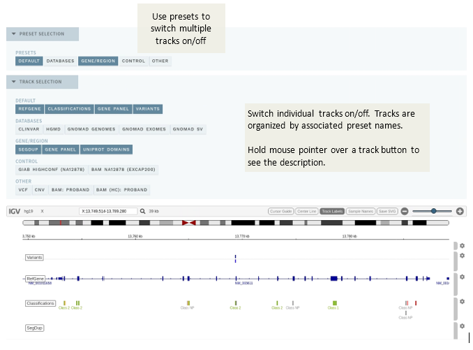

# Visual mode

[[toc]]

Pushing the `VISUAL` button (available in ANALYSIS mode only) in the side bar opens the VISUAL mode:

 

This mode features an [integrated version](https://github.com/igvteam/igv.js) (v2.7.9) of [Integrative Genomics Viewer (IGV)](http://software.broadinstitute.org/software/igv/):

## Track selection

With IGV, you can visualize all variants in an analysis, along with customizable tracks at three different levels: global, user group or analysis. Each individual track can be switched on/off using the associated button, and multiple tracks can be switched on/off by configuring presets, which are shown at the top.

### Global tracks

Global tracks are available to all users. These currently include: 

- `REFGENE`: Transcripts from RefGene.
- `GENE PANEL`: Regions covered by the current gene panel.
- `VARIANTS`: All variants in the same sample (analysis) _after_ filtering.
- `CLASSIFICATIONS`: All existing classifications present in the database.
	
### Group tracks

Tracks that are specific to your user group in ELLA. 

### Analysis tracks

Analysis tracks are specific to the analysis (depending on configuration). These may include:

- `BAM` files: Raw alignments (HTS data only), split by family members if relevant
- `VCF`: All variants called in the VCF file (HTS data only, within gene panel, no filtering)
- `CNV`: Called CNVs (HTS data only)

## Side bar: Mark as TECHNICAL

A button `T` is available in the side bar next to each variant for quickly marking technical variants. This works the same as in [Quick classification mode](/manual/quick-classification.md), where clicking the button moves the variant to the TECHNICAL VARIANTS section in the side bar. If applicable, add a comment before moving to the next variant; this will also be reflected in the ANALYSIS SPECIFIC comment field on the CLASSIFICATION page.
