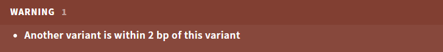
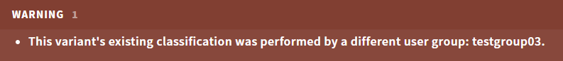

# Variant warnings

Variant warnings are shown as a banner for certain conditions that require special attention, and are triggered when you select the variant. The list of warnings includes:

[[toc]]

## Annotation warnings

Annotation warnings are displayed both as a [tag in the side bar](/manual/side-bar.html#variant-tags) (`!`) and as a red warning banner on the top: 

Warnings include: 

- Worse consequences found in other transcripts, e.g. intron variant in default transcript, exon variant in alternative transcript. See the PREDICTION section for further details.
- Other variants are within 2 bp of the variant in the analysis (often indicative of technically challenging regions or that annotation should be manually verified).

Note that a distinct ["Needs verification" warning](/manual/evidence-sections.html#warning-needs-verification) is shown in the QUALITY card for variants of questionable variant calling quality. 

## Collision warnings

If you open a variant that is also present in another ongoing analysis, and the variant is unfiltered and new or outdated, ELLA will display a collision warning: 

This means that changes you make to the variant will overwrite the other user's changes, or vice versa. You should therefore wait until the variant is finalized by the other user, or clarify with the other user if you should do the interpretation instead.  

Similarly, if another user imports new results to an analysis you have already opened, a warning will be displayed upon next save or if you try to finish the analysis: `ADDITIONAL DATA HAVE BEEN ADDED TO THIS ANALYSIS. PLEASE REFRESH`. In this case, simply refresh your browser (Ctrl + R), which will add the new variants to the analysis.

::: warning NOTE
If a variant classification is still valid, no collision warnings will be triggered, even if the variant is being re-evaluated. 
:::

### Message when variant updated by another user

If a user has an analysis open with a finalized variant, and then another user updates (finalizes) the same variant in another analysis, the first user will get a message at the bottom of the screen that the new evaluation was loaded: 

::: warning NOTE
The message is only displayed when a user finalizes another variant or manually refreshes the view.
:::

## User group warnings

Variant interpretations are sometimes shared between multiple user groups due to overlapping gene panels. If the last user to classify (finalize) the variant was from another user group than your own, ELLA displays a warning both as a [tag in the side bar](/manual/side-bar.html#variant-tags) (`!`) and as a red warning banner on the top: 

