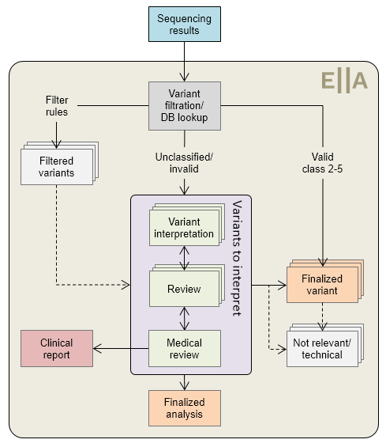

# Workflows

[[toc]]

ELLA allows both interpretation of [ANALYSES](#sample-centered-workflow-analyses) of variants in the context of a sample and a pre-specified gene panel, and individual [VARIANTS](#variant-centered-workflow-variants) (independent of laboratory samples). Common to both workflows is that any analysis or variant interpretation should normally be reviewed. However, all steps are optional, and you may finalize at any time. 

## ANALYSES workflow for samples

An ANALYSIS is tied to both a specific laboratory sample and a gene panel. Note that this means that the same patient may be present in multiple analyses. In these instances, each analysis is treated separately, and it is not possible to merge results. 

A schematic representation of a typical ANALYSES workflow is shown in **Figure 1** below.

  
  
<strong>Figure 1:</strong> Typical ANALYSES workflow.

Valid classifications are defined in the [configuration](/technical/acmg.html#classification) (e.g. <6 months old). Each variant may be finalized at any time. The review steps are optional, and may be omitted for low-complexity samples (e.g. only benign variants and/or still valid existing classifications).

Note that each variant in the analysis must be finalized or set to not relevant or technical independently before the analysis containing the variants can be finalized. 

## VARIANTS workflow for independent variants

If you have imported stand-alone variants (independent of any sample), or use search to locate and open a variant, the alternative VARIANTS workflow is used. The most important difference is that the VARIANTS workflow does not show any sample-specific information/functionality, which includes:

- Genotype
- Quality of the variant call 
- Possibility for generating a clinical report (although you may add/edit comments for a subsequent report in a sample)

Furthermore, the workflow is much simpler, and only includes an INTERPRETATION and a REVIEW step. No filtering or auto-finalization if the variant was already (recently) classified is applied. 