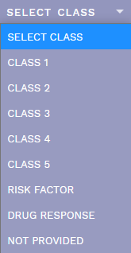
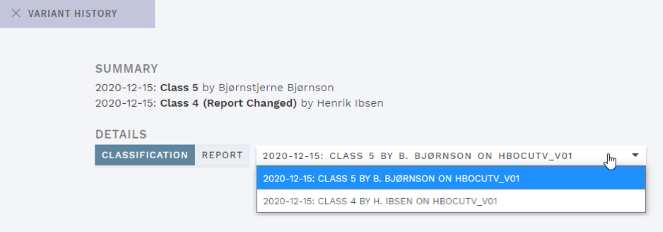
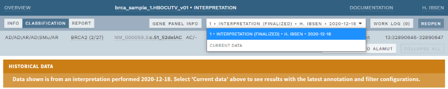
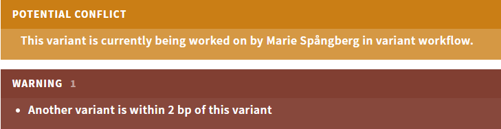
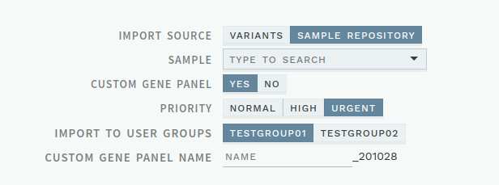

# Release notes: Latest releases

|Major versions|Minor versions|
|:--|:--|
[v1.12](#version-1-12)|
[v1.11](#version-1-11)|[v1.11.1](#version-1-11-1), [v1.11.2](#version-1-11-2), [v1.11.3](#version-1-11-3)
[v1.10](#version-1-10)|[v1.10.1](#version-1-10-1)

See [older releases](/releasenotes/olderreleases.md) for earlier versions.

## Version 1.12

Release date: 13.01.2021

### Highlights

This release includes many fixes and improvements, both to the frontend and backend/development environment. The most significant changes for users include changes to [classification](#redefined-classification-choices), [history](#improvements-to-history) and [variant warnings](#improved-warnings): 

#### Redefined classification choices

<!-- MR !477 -->
Variant classification choices have been redefined in line with [ClinVar definitions](https://www.ncbi.nlm.nih.gov/clinvar/docs/clinsig/): 
- `CLASS U` was renamed to `NOT PROVIDED`, meant for recording various information (literature/research/clinical/phenotyping) without interpreting clinical significance. It is recommended to configure this class to be immediately outdated.
- The choice `RISK FACTOR` was added, meant for variants that are interpreted not to cause a disorder but to increase the risk.

The classification choices are now: 

     
    
<strong>Figure: </strong>Redefined variant classification choices.

#### Improvements to history

<!-- MR !465 --> 
History for changes to the variant CLASSIFICATION REPORT field was added, and the HISTORY pop-up now shows a drop-down for viewing previous versions instead of listing them: 

     
    
<strong>Figure: </strong>Modified variant history view with addition of Report history and drop-down for previous versions.

<!-- MR !454 -->
In addition, when opening a previously finalized analysis, ELLA will now default to displaying the state corresponding to the latest interpretation round, i.e. showing variant interpretations, classifications and annotation exactly as they were presented at the time of the last finalization. The previous default, `CURRENT DATA` (along with any other interpretation round), is still available using the drop-down in the top bar. To prevent confusion, a warning was added when viewing historical data. 

     
    
<strong>Figure: </strong>Latest interpretation round now selected by default (with warning) for historic analyses.

#### Improved warnings

<!-- MR !458 --> 
To improve visibility of the different variant warnings displayed on the CLASSIFICATION page, collision warnings are now shown in a yellow banner separate from annotation and user group warnings (red), and collision warnings are no longer included in the `!` tag in the sidebar: 

    
    
<strong>Figure: </strong>Collision and annotation warnings are now separate.

<!-- MR !456 --> 
In addition, ELLA now displays a message at the bottom of the page if a finalized variant in an ongoing analysis has been updated and finalized by another user: 

    
    
<strong>Figure: </strong>Message when evaluation has been updated by another user.

Note that the message is only displayed when a user finalizes another variant or manually refreshes the view.

#### Select user group on custom imports

<!-- MR !463-->
To better support custom gene panel imports that should be available to more than one user group, the custom gene panel import dialogue now includes an option to select user groups: 

    
    
<strong>Figure: </strong>Message when evaluation has been updated by another user.

### All changes

<!-- MR !477 -->
- [Redefined classification choices in line with ClinVar definitions](#redefined-classification-choices).
<!-- MR !465 -->
- [Improved design of the history modal, with addition of CLASSIFICATION REPORT history and sorted ACMG criteria](#improvements-to-history).
<!-- MR !454 -->
- [Show latest interpretation round by default for historical analyses, including warning](#improvements-to-history).
<!-- MR !458 -->
- [Variant collision warnings are now separated from annotation warnings on the CLASSIFICATION page](#improved-warnings).
<!-- MR !456 -->
- [Display message when variant in ongoing analysis has been updated by another user](#improved-warnings).
<!-- MR !463 -->
- [Added possibility to select which user groups an imported custom gene panel analysis should be available to](#select-user-group-on-custom-imports). 
<!-- MR !433 -->
- Search result limit has been increased from 10 to 100.
<!-- MR !435 -->
- Added more external links in the gene information popup (ClinGen, PanelApp and ACMG incidental findings).
<!-- MR !475 -->
- Updated HGMD Pro links to point to new base url. 
<!-- MR !450 -->
- Added support for templates in the Gene information comment field.
<!-- MR !473 -->
- Added possibility for linking attachments on the INFO page.
<!-- MR !444 -->
- Made allele list in top bar scrollable when number of transcripts exceed 3. 
<!-- MR !453 -->
- Fixed wrong tooltip on `SUBMIT REPORT` button.
<!-- MR !455 -->
- Fixed a bug that caused variants that were removed from the REPORT to be added back again without user intent. 
<!-- MR !482 -->
- Fixed a bug that caused errors in loading of historical data.
<!-- MR !429, !443, !446, !462, !464, !468, !469, !470, !474, !478, !483 -->
- Many fixes and improvements to development environment and code base.

## Version 1.11.3

Release date 11.11.2020

### Highlights

This release adds a bugfix for the frequency filter. 

### All changes

<!-- MR !466 -->
- Fixed a bug that caused a timeout in the frequency filter and failed loading of the associated analysis.

## Version 1.11.2

Release date: 27.10.2020

### Highlights

This release adds bugfixes related to manually appending results to an analysis.

### All changes

<!-- MR !449 -->
- Fixed a bug where filters using `inheritance_mode` failed to load when there are more than two proband samples in an analysis (e.g. on manual appending import). 
<!-- MR !452-->
- Fixed a bug where manually appending an import to a finalized analysis fails. 
<!-- !442, !447 and !461: no release notes necessary -->

## Version 1.11.1

Release date: 21.08.2020

### Highlights

This release adds a few bugfixes and improvements. 

### All changes

<!-- MR !440 -->
- Implemented a workaround for an [igv.js bug](https://github.com/igvteam/igv.js/issues/136) to properly distinguish reads with mapping quality 0 from other reads (these will be now be shown with lighter colors). 
<!-- MR !437 -->
- Added support for haploid genotypes.
<!-- MR !436-->
- Added CLI support for [deleting allele interpretations](/technical/production-tasks.html#delete-allele-interpretation) and [deleting analyses with associated allele assessments](/technical/production-tasks.html#delete-analysis).
<!-- MR !441-->
- Fixed bug causing incorrect calculation of class with ACMG criteria PS* + 2 PM*.

## Version 1.11

Release date: 25.06.2020

### Highlights

This release brings an improved gene information popup with editing possibilities, and several changes and improvements to the OVERVIEW page. 

#### User-editable gene information

The [gene information popup](/manual/top-bar.html#gene-information) (click the gene name in the top bar) has been improved, with the possibility to add and edit comments about the gene. This can be used for information that is important for evaluating variants in this gene, and is available for all analyses where the gene is included.  

    
    
<strong>Figure: </strong>User-editable gene information.

If a comment has been added, an `INFO` tag is shown next to the gene name. 

#### New OVERVIEW filter feature

A new [filter feature](/manual/choosing-sample-variant.html#filter-the-overview) was added to the ANALYSES OVERVIEW page to quickly locate subsets of analyses. You can filter by these parameters: 

- Analysis name
- Comment text (e.g. useful with [auto-comments](#custom-overview-sections-replaced-with-auto-comments))
- Date requested (ranges up to current date)
- Show only 
    - HTS/Sanger
    - Priorities Normal/High/Urgent

Any combination of these filters is allowed.

    
    
<strong>Figure: </strong>User-editable gene information.

Note that the filters do _not_ include finalized analyses. 

#### Optional OVERVIEW sections replaced with auto-comments

This release retires the optional classification status sections on the OVERVIEW page and replaces them with a possibility to [auto-add comments](/manual/choosing-sample-variant.html#optional-auto-comments) (`ALL CLASSIFIED`/`NO VARIANTS`) upon deposit of new analyses to the ELLA database. In addition, the [VARIANTS OVERVIEW](/manual/choosing-sample-variant.html#variants-worklist) page has been limited to manually imported, stand-alone variants or individual variants opened from search. 

#### Option to set GQ thresholds for de novo candidates

To remove false positive de novo predictions in the segregation filter, it is now possible to set a genotype quality (GQ) threshold. This will disregard any de novo prediction where the proband, father or mother in a trio has a GQ value below the given thresholds. 

### All changes

<!-- MR !422 -->
- [Added possibility to edit and save gene information](#user-editable-gene-information).
<!-- MR !420 -->
- [Added filtering feature in the ANALYSES OVERVIEW](#new-overview-filter-feature).
<!-- MR !426 -->
- [Replaced optional ANALYSES OVERVIEW sections with auto-comments](#optional-overview-sections-replaced-with-auto-comments)
<!-- MR !431 -->
- [Added option for GQ threshold for de novo candidates](#option-to-set-gq-thresholds-for-de-novo-candidates)
<!-- MR !426 -->
- Fixed a bug causing previously cleared warning tags to remain in the Finalized section and in search results.

## Version 1.10.1

Release data: 15.06.2020

### Highlights

This release fixes a few bugs bugs related to references and reference assessments.

### All changes
<!-- MR !424 -->
- Fixed a bug where existing reference assessments would not show if no longer part of annotation
<!-- MR !427 -->
- Fixed a bug where ClinVar references would not be recognized during import of ClinVar annotation
<!-- MR !428 -->
- Fixed a bug where HGMD reference comments would display un-translated character sequences

## Version 1.10

Release date: 09.06.2020

### Highlights

This release brings improvements to the variant filters, a new version of IGV for Visual mode, as well as several smaller improvements and fixes. 

#### Improved variant filters

All criteria in the [segregation filter](/technical/filtering.html#segregation-filter) can now be enabled/disabled separately, allowing for increased flexibility. In addition, the [quality filter](/technical/filtering.html#quality-filter) can now use the VCF `FILTER` status (`PASS`/...) as a parameter. 

### All changes

<!-- MR !409; also updated filtering.md --> 
- [Added configuration for segregation filter](#improved-variant-filters).
<!-- MR !416; also updated filtering.md -->
- Renamed "Inherited mosaicism" to "[Parental mosaicism](/technical/filtering.html#parental-mosaicism)"; The associated [`M` tag](/manual/side-bar.html#variant-tags) can now appear together with other Segregation tags in the sidebar if multiple conditions are true.
<!-- MR !368; also updated filtering.md -->
- [Added possibility for using VCF `FILTER` status in quality filter](#improved-variant-filters).
<!-- MR !417; also updated evidence-sections.md -->
- Removed `QUAL`≤300 as a criterion for the [NEEDS VERIFICATION warning](/manual/evidence-sections.html#warning-needs-verification) and the [`Q` tag](/manual/side-bar.html#variant-tags).
<!-- MR !397 -->  
- Upgraded IGV (in Visual mode) to version 2.5.4, with several minor improvements.
<!-- MR !419; also updated top-bar.md -->
- The number shown on the `WORK LOG` button now includes a count of all user added messages, including from previously finalized analysis rounds.
<!-- MR !370 -->
- Removed `VARIANT REPORT` button from OVERVIEW.
<!-- MR !410 -->  
- Open the previously selected overview page when returning from search.
<!-- MR !407 --> 
- Fixed a bug causing wrong open-end position for insertions.
<!-- MR !411 -->
- Fixed a bug causing incorrect filtering for regions with 1 base.
<!-- MR !421 --> 
- Fixed a bug causing incorrect rescue of variants annotated with non-standard terms in the ClinVar database.
<!-- MR !412 --> 
- Fixed a bug causing a wide sidebar with long indication comments.
<!-- MR !418 -->
- Fixed a bug causing missing word wrap in comment fields.
<!-- MR !377 Add flake8: no release note necessary -->

