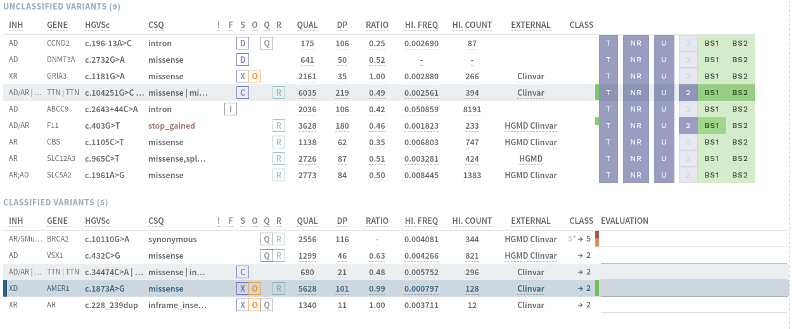
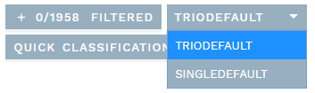
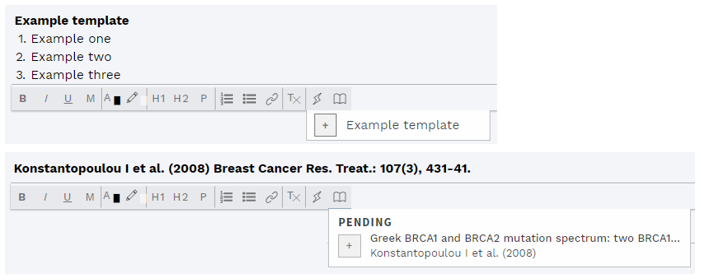
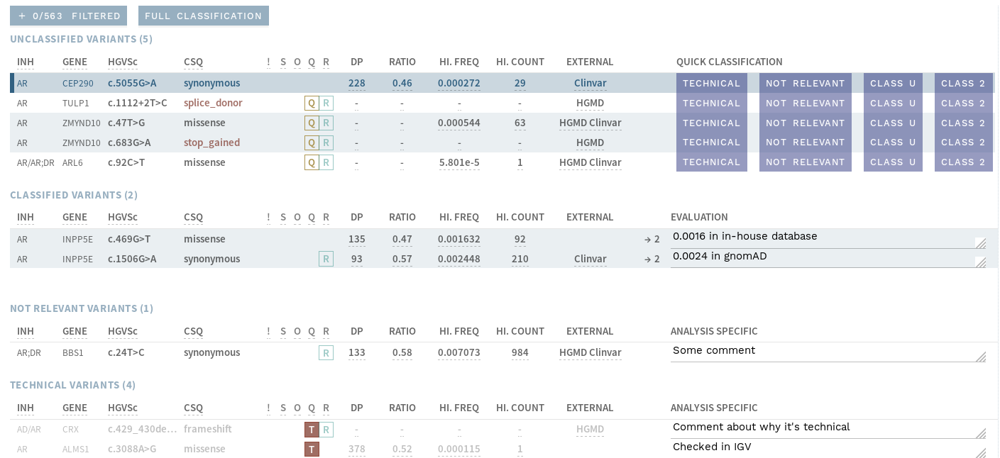
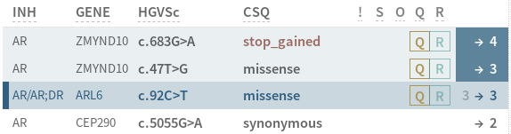
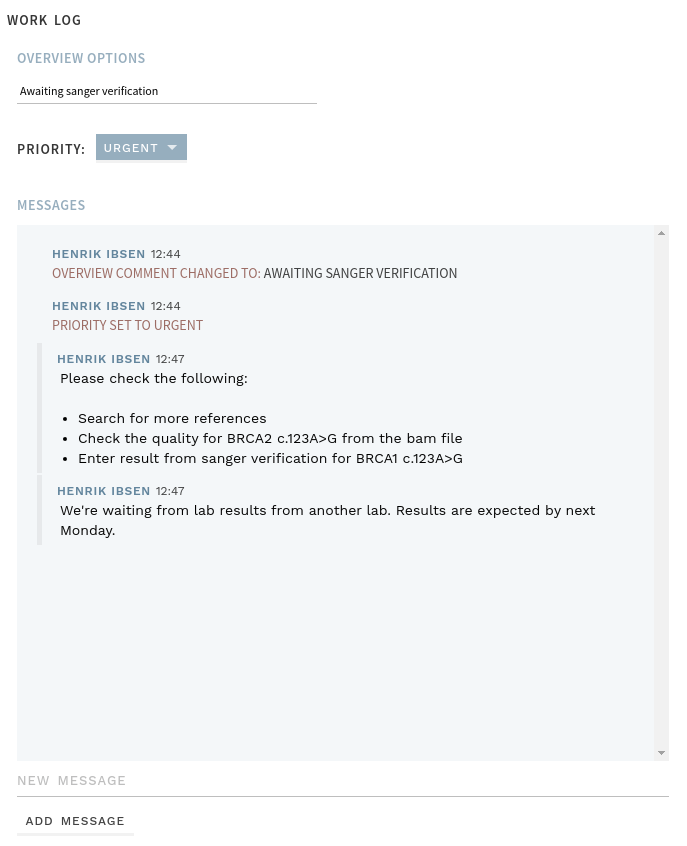
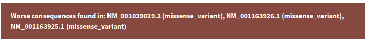
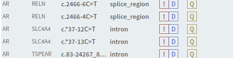
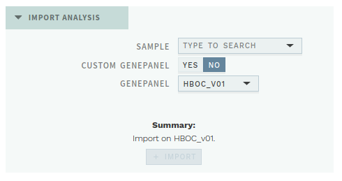

# Release notes

- [1.7](#_1-7)
- [1.6.2](#_1-6-2)
- [1.6.1](#_1-6-1)
- [1.6](#_1-6)
- [1.5](#_1-5)
- [1.4.1](#_1-4-1)
- [1.4](#_1-4)
- [1.3.1](#_1-3-1)
- [1.3](#_1-3)
- [1.2](#_1-2)
- [1.1.2](#_1-1-2)
- [1.1.1](#_1-1-1)
- [1.1](#_1-1)

## 1.7

### Highlights

#### Improved import function

Import of variants in various text formats and ordering of reanalyses from existing samples is now merged into a single import section on the OVERVIEW page, replacing the old `IMPORT` button in the top bar. 

In addition, it is now possible to search for multiple genes at once (batch query) when ordering a custom reanalysis, e.g. by pasting a list of genes from an external source. Both gene names and HGNC ID is supported, and any genes not found are shown as a list that can be copied out. 

    
     
    

        <strong>Figure: </strong>The new batch filter mode for searching for multiple genes when ordering a custom reanalysis.
    

     

#### Gene panel info

Various information about the gene panel used in an analysis is now available via a new button in the top bar: 

The information includes which genes are in the panel (with inheritance and default transcript available on mouse-over; list can be copied), as well as a list of the five most similar gene panels: 

    
     
    

        <strong>Figure: </strong>Gene panel info.
    

     

#### Improvements to attachments

Attachments are now named after the filename (instead of an index number), and details are available by hovering the mouse over an attachment.

### Complete list of changes, additions and fixes

- [Merged import functions into single section on OVERVIEW page](#improved-import-function).
- [Added possibility for batch queries of genes to include in a reanalysis](#improved-import-function).
- [Added gene panel info](#gene-panel-info).
- [Attachments named after filename, mouse-over gives details](#improvements-to-attachments).
- Fixed bug causing missing comment field (REPORT).
- Harmonized formatting of REPORT field on CLASSIFICATION and REPORT pages. 

## 1.6.2

### Fixes

- Fixed performance bug that caused excessive loading time for ANALYSES overview.

## 1.6.1

### Fixes

- Fixed add/remove buttons for variants not working in REPORT side bar.

## 1.6

### Highlights

This update brings a few improvements to the user interface and workflow, in addition to several bug fixes. 

#### Quick check boxes for BS1/BS2 and ACMG indicators

The most noticeable changes are the addition of selection buttons for ACMG criteria BS1 and BS2 (and shortened button titles) in the QUICK CLASSIFICATION mode, and addition of indicators for added ACMG criteria in the side bar. 

Note that to select CLASS 2 for a variant in QUICK CLASSIFICATION mode, you must now first add at least one benign ACMG criterion (e.g. BS1/BS2 via the check boxes); see the figure below.

    
     
    

        <strong>Figure: </strong>Check boxes for BS1 and BS2 for CLASS 2, and ACMG indicators (vertical bars next to CLASS column) in side bar.
    

     

#### Outdated variants treated as UNCLASSIFIED 

This update also brings a few changes to how outdated variant interpretations are handled. These are now grouped with UNCLASSIFIED variants in the side bar of an analysis, and must be reopened individually by clicking the RE-EVALUATE button if a new evaluation is to be made. This is to ensure a new validity period is only set for variants that have actually been re-evaluated. 

As an added measure, the classification of reopened variants must also be actively reselected.

### Complete list of changes, additions and fixes
- QUICK CLASSIFICATION mode: Added check boxes for ACMG criteria BS1 and BS2 (for class 2), shortened button titles.
- Side bar: Added indicators for added ACMG criteria (full list on mouse-over).
- Disallow adding the same ACMG criterion (irrespective of strength modifications) more than once to the same variant interpretation.
- Sort added ACMG criteria by pathogenic-benign, then strength.
- Variants with outdated interpretations are now grouped with UNCLASSIFIED VARIANTS in the side bar in an analysis, and are no longer automatically reopened with the analysis.
- Added possibility to edit comments on individual studies in STUDIES & REFERENCES section directly in the list (without opening the evaluation form) after first evaluation.
- When there are multiple VEP CSQs (consequences) for a variant, these are now sorted in the side bar by severity (worst consequence first). 
- TECHNICAL button is now available also for CLASSIFIED VARIANTS in VISUAL.
- Added subtitle "FOR VARIANT" to the ANALYSIS SPECIFIC section on the CLASSIFICATION page, to avoid confusion (some users mistook the section to apply to the analysis as a whole, not the particular variant).
- REPORT page: Added homo-/hemizygous variants were not correctly HGVSc-formatted. As a temporary fix (until formatting is properly fixed), all HGVSc is now formatted with empty brackets for nucleotide changes, to be filled out by the user.
- Fixed bug where variants from other user group showed up in the VARIANTS overview.
- Reference evaluation form: Renamed `SAVE` button to `CLOSE`, removed `CANCEL` button.
- Fixed missing mouse-over for `M` tag in the side bar.

## 1.5

### Highlights

#### Classification view modes

The VISUALIZATION page has been redefined as a view mode on the CLASSIFICATION page, allowing for easier switching between relevant views while performing variant classification. Switching between view modes can now be done with three buttons above the variant list in the side bar: 

 

- `FULL` (new button; default view mode).
- `QUICK` (renamed from QUICK CLASSIFICATION).
- `VISUAL` (renamed from VISUALIZATION; button moved from top bar).

#### Changes to side bar functionality

It is now possible to mark variants as `TECHNICAL` in the side bar in VISUAL mode (with commenting after marking, similar to QUICK mode), and the INDICATIONS COMMENT from the REPORT page is mirrored in the side bar on the CLASSIFICATION page, allowing for a more efficient workflow. 

#### ACMG modified criteria according to ClinGen 
ACMG criteria where the strength of the original criterion are now displayed according to ClinGen's recommendations, e.g. `PM1_Strong` instead of `PSxPM1`. 

### Complete list of additions and fixes
- VISUALIZATION redefined as view mode VISUAL on CLASSIFICATION page, with navigation moved to the side bar.
- Added function to mark as `TECHNICAL` (button and comment) in VISUAL mode.
- Mirrored INDICATIONS COMMENT from the REPORT in the side bar on the CLASSIFICATION page.
- Changed naming of ACMG criteria with modified strength to ClinGen's recommendations. 
- Added QUAL column to variant lists in the side bar for analysis workflow (QUICK and VISUAL mode) and filtered variants.
- Adding/removing variants in the REPORT restricted to toggle button (not clicking the anywhere on the variant).
- Fixed sorting on F column (tag: Included) in the side bar.
- Fix issue where gene panel was not reloaded when including a filtered variant.

## 1.4.1

### Additions and fixes
- Increase overview update interval to lessen strain server.
- Fix automatic import of analyses with underscore in the gene panel name.
- Fix issue where finalization would not work under certain conditions.

## 1.4

### Highlights

#### Variant filter configurations

ella now supports configuring several filter configurations for a user group. This lets you define filter chains that are specific to certain types of analyses (e.g. single or trio analyses) or specific analysis names. One analysis can have several applicable filter configurations which will show up as options in the side bar inside the analysis workflow: 

    
     
    

        <strong>Figure: </strong>Switch between different filter configurations in an ongoing analysis.
    

     

Examples of possible filter configurations are different levels of frequency thresholds, or being able to turn on and off family (segregation) filtering for an analysis.

#### New variant filters

Current filters include: 

- Classification filter
- Consequence filter
- External filter
- Frequency filter
- Inheritance model filter
- Polypyrimidine filter
- Quality filter
- Region filter
- Segregation filter

See new section [Concepts/Filters](/concepts/filtering.md) in the documentation for details on how these filters work and how to configure them. 

#### Comment editor additions

The comment editor now supports inserting pre-defined templates, as well as references from the STUDIES & REFERENCES section, using two new buttons in the comment field menu. Templates can be defined independently for different comment fields, and supports basic text formatting.

    
     
    

        <strong>Figure: </strong>Adding templates and references.
    

     

If no template has been defined or no reference has been found/added (STUDIES & REFERENCES section), the respective buttons will be inactive (greyed out).

### New features

- [Variant filter configurations](/releasenotes/#variant-filter-configurations).
- [New filters (turn on/off in configuration)](/releasenotes/#new-variant-filters).
- [Use text templates and add references in comment fields](/releasenotes/#comment-editor-additions).
- Work log: Hide system messages by clicking `MESSAGES ONLY`.
- New class: "Drug response" (as defined in [ClinVar](https://www.ncbi.nlm.nih.gov/clinvar/docs/clinsig/)).
- New "Indication comment" on the REPORT page, for comments specifically about the patient's indication.
- Nearby variants warning now checks all variants in analysis (previously only checked non-filtered variants). Now also checks nearby within 2bp (possibly same codon), rather than 3bp.
- Empty gnomAD, ClinVar and HGMD Pro records now have external links to generic pages. 
- Added warning for expiring passwords.

### Other additions and fixes

- Added `ADD STUDIES` button in top bar.
- Fixed description for ACMG criterion BP6.
- Fixed missing scrolling in "Show analyses".
- "PL" removed from Quality card in ANALYSIS SPECIFIC section.
- Changed order of sections on CLASSIFICATION page to PREDICTION - EXTERNAL - STUDIES & REFERENCES
- References are now ordered (descending) according to publication year.
- Changed colour of `O` tag in side bar.

### Backend

- Added broadcast functionality to convey important messages in *ella* to all users.
- Improvements to filter efficiency and speed.

## 1.3.1

### Additions and fixes
- Fix issue in `Variant report` when parsing warning from pipeline, in some cases yielding wrong number of poorly covered regions.

## 1.3

### Highlights

#### Visualization *(analysis workflow)*

As part of this release, [igv.js](https://igv.org/doc/doc.html) has been integrated into ella as part of a new visualization feature. ella now let's you visualize all variants in an analysis, along with user customizable tracks at three different levels: global (all users), user group and analysis.

ella provides a few special tracks by default:

- Gene panel: Shows the analysis' gene panel.
- Classifications: Shows all classifications present in the database.
- Variants: Shows the analysis variants _after_ filtering.

    
      
    

        <strong>Figure: </strong>New visualization feature.
    

     

#### Mark "Not relevant" *(analysis workflow)*

Variants can now be marked as `Not relevant` for the analysis. Such variants can, depending on the user's configuration, be left without a selected class upon finalization of the analysis.

#### Quick classification *(analysis workflow)*

A new quick classification view is now available, aimed at certain workflows for large analyses with many variants.
It gives a summary of the most important information necessary for classifying variants as `Technical`, `Not relevant` or `Class 2`.

It is most relevant for workflows where you first perform a quicker interpretation of certain variants, before doing a more thorough interpretation of the remaining ones.

    
      
    

        <strong>Figure: </strong>Quick classification view.
    

     

#### QUALITY card renamed to ANALYSIS SPECIFIC *(analysis workflow)*

The card in `Classification` view previously referred to as `QUALITY` is now called `ANALYSIS SPECIFIC` to highlight the fact that it's not part of a variant's classification, but rather just a part of the analysis.

The card is blue and collapsed by default, to further separate it from the classification related cards.

#### Improved view of existing and current class in sidebar *(analysis workflow)*

The view of a variant's class in the sidebar has been improved.

Left number is existing class, right is new. An arrow indicates that a new classification will be created. Blue background indicates that the variant has been reviewed. You can toggle the review status by clicking on the class in the sidebar.

    

#### New user manual

A new, online user manual is now available from within ella itself. You can access it by clicking `Documentation` in the top navigation bar in the overview.

### New features

- [Visualization *(analysis workflow)*](/releasenotes/#visualization-analysis-workflow).
- [Ability to mark variants `Not relevant` *(analysis workflow)*](/releasenotes/#mark-not-relevant-analysis-workflow).
- [Quick classification *(analysis workflow)*](/releasenotes/#quick-classification-analysis-workflow).
- Filters and their parameters are now configurable per user group
- New filter: Quality
- Region filter now can save variants with certain (configurable) consequences from being filtered.
- New variant warning: HGVSc and HGVSp mismatch between corresponding Refseq and Ensembl transcripts.
- [Integrated documentation within ella](/releasenotes/#new-user-manual).

### Other additions and fixes
- Filtered variants are now shown as a list *(analysis workflow)*.
- [`QUALITY` card is renamed to `ANALYSIS SPECIFIC` *(analysis workflow)*](/releasenotes/#quality-card-renamed-to-analysis-specific-analysis-workflow).
- [Improved view of class in sidebar *(analysis workflow)*](/releasenotes/#improved-view-of-existing-and-current-class-in-sidebar-analysis-workflow).
- Workflows can now be finalized with technical, not relevant and/or missing classifications (depending on configuration). Workflows can still force valid classifications for all variants if desired (old behavior). *(analysis workflow)*
- `Requested date` is now read from input `.analysis` file and used in overview.
- Too wide images in comments will not make the page scrollable in the horizontal direction.
- Overview comment is now visible for `Finalised` analyses and variants in overview.
- Low quality warning is removed for Sanger variants, as there is no quality data.
- HTML content is now properly sanitized when pasted into comment fields.
- Fix issue where technical status was not reflected in the `TECHNICAL` button in the `QUALITY` card under certain conditions.
- Fix issue where image could not be resized in reference evaluation.

## 1.2

### Highlights

#### Family analysis

ella now lets you interpret analyses with variants that have been joint called within a single family.

The following segregation models are supported:

- De novo
- Autosomal recessive homozygous
- X-linked recessive
- Compound heterozygous

The most powerful filtering requires two parents to be present in the analysis, but
some segregation filters and tags also apply to analyses with only siblings (unaffected and/or affected).

    
     
    

        <strong>Figure: </strong>Segregation tags in sidebar.
    

     

Variants filtered out by these filters can be found in the `Segregation` category in the excluded variants.

#### Work log

The analysis and variant workflows now have their own `Work log`. The work log currently lets you:

- Update the `Overview comment` (previously `Review comment`)
- Clear any analysis warnings *(analysis only)*. Clearing a warning makes the warning tag disappear from the Overview.
- Adjust the priority of the analysis or variant
- Add messages that should be available to yourself or later interpreters about things that are relevant for the interpretation of the analysis or variant. Messages can contain formatting and images, and are editable until the next interpretation round is started.

All options in the work log can be changed at any time, without having to start a new interpretation round.

    
     
    

        <strong>Figure: </strong>Work log example.
    

     

If there are any messages since last time the workflow was `Finalised`, the work log button will appear in purple, along with the current message count.

    
     
    

        <strong>Figure: </strong>2 messages since beginning or last finalization.
    

     

#### Variant warnings

Variants are now tagged with warnings whenever there is something special that considered for the variant in question. The list of warnings will be expanded later, but currently includes:

- Worse consequences in other transcripts
- Other variants are within 3 bp of the variant in the analysis

Variant warnings are implemented for both the variant and analysis workflows, but some warnings are only available for analyses.

    
     
    

        <strong>Figure: </strong>Example warning.
    

     

    
     
    

        <strong>Figure: </strong>Warning tags in sidebar.</i>
    

### New features

- Support for family data
- Segregation filter and tags
- Work log
- Variant warnings

### Other additions and fixes
- `Quality` is now it's own section in Classification view (*analysis only*)
- Quality verification for variants in an analysis (`Verified` and `Technical`) is moved from the Info view to the Quality section in the Classification view.
- Variants marked as `Technical` are moved to it's own list in the sidebar.
- Improvements in display of variants with multiple selected transcripts.

## 1.1.2

### Additions and fixes

- Add red 'HOM' tag to top variant bar in order to improve homozygous visibility.
- Merge `utr` and `intron` filters into a new, improved `region` filter.
- Improve search performance (entering a gene is now required for searches using HGVS nomenclature).
- Show more information about the available samples in import view
- Add new external database for gene TP53
- Fix missing Hemi total count for gnomAD

## 1.1.1

### Additions and fixes

- Add BRCA Exchange to external databases for BRCA1 and BRCA2
- Add ability to search using genomic position on format g.123456
- Keep existing reference evaluation data when clicking 'Ignore'
- Fix link and reference description in reference evaluation window.
- Fix issue where some variants would appear with two gene panels in variants overview
- Fix issue where worst consequence would not display correctly for a rare case with variant having intron_variant as consequence in one transcript and splice_region_variant, intron_variant as consequences in another transcript.
- Fix issue importing Pubmed XML data for some references.

## 1.1

### Highlights

#### New import functionality

*Requires access to the import view.*

ella now lets you re-import previously run samples, using either an existing gene panel or a gene panel customized for that specific sample.

This lets you request new analyses directly in the application and shortens the time for reanalysis with a different set of genes.

#### Frontend code improvements

The frontend code has been refactored to make it more responsive and to make it easier to add new functionality going forward.

### Other additions and fixes

- Display number of excluded references on 'SHOW EXCLUDED' button
- Remove scrollbar on comment fields.
- When there are multiple transcripts in a gene panel, sort them by name. Also display all transcripts in more places, for example in the variants overview.
- Do not add references with Relevance: 'No' to the excluded references list.
- The 'ADD EXCLUDED' window for adding excluded variants now loads faster.
- Search results will now show correctly when typing quickly.
- Many other smaller UI fixes
