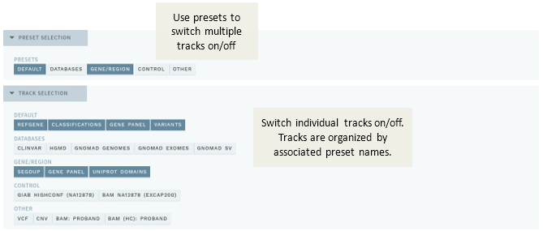
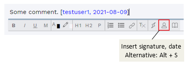
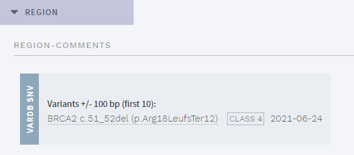
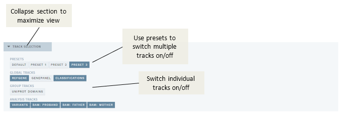
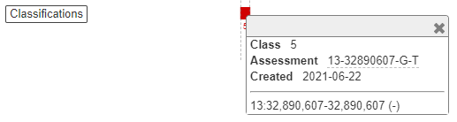

# Release notes: Latest releases

|Major versions|Minor versions|
|:--|:--|
[v1.16](#version-1-16)|
[v1.15](#version-1-15)|[v1.15.1](#version-1-15-1)
[v1.14](#version-1-14)|[v1.14.1](#version-1-14-1), [v1.14.2](#version-1-14-2)
[v1.13](#version-1-13)|[v1.13.1](#version-1-13-1), [v1.13.2](#version-1-13-2)

See [older releases](/releasenotes/olderreleases.md) for earlier versions.

## Version 1.16

Release date: TBD

### Highlights

This version introduces a big change: Support for copy number variants (CNVs)! The current solution is "bare bones", but will show CNVs in a separate variant list and allow documenting and reusing CNV interpretations, as for SNVs. 

Known limitations in this version: 
- Only CNV deletions, duplications and tandem duplications are supported (VCF: `DEL`, `DUP` and `DUP:TANDEM`, respectively; for variants of type = `SVTYPE`).
- No variant filtering is done for CNVs in ELLA, for the time being this needs to be done upstream, prior to import. 
- No particular adaptations have been made to presentation of annotation. However, any annotation from the VCF can be added in the configuration, and we recommend adding CNV-specific tracks to VISUAL to aid in interpretation.
- No CNV-specific ACMG criteria have been added.

Due to these limitations we recommend restricting CNV analyses to smaller gene panels for now. But stay tuned, we plan to improve on all of the above in the time to come. 

Note: If you only plan to use ELLA for SNVs (or wish to wait until more features are in place), the CNV-specific features can be turned off using [...]. 

[TODO: screenshots and some more detail, update manual and technical docs]

### :small_red_triangle: Breaking changes

### All changes

<!-- 
MR !575 cnv release candidate
MR !626 Clean up VCF iterator
MR !606 Feature flag for CNVs
-->
- Added minimal support for CNVs.
<!-- MR !611 -->
- Updated order of VEP consequences to match the [Ensembl default](https://www.ensembl.org/info/genome/variation/prediction/predicted_data.html).
<!-- MR !627 -->
- Filtered variants are now sorted by genomic position.
<!-- 
No further release notes necessary, but adding here for reference: 
MR !584 Refactor ReferenceEvalModal
MR !596 Refactor wysiwygjs
MR !600 CI is not detecting front end javascript test failures
MR !603 Provide a CORS policy for ELLA
MR !607 Improvements to region filter
MR !622 increase-api-call-timeout
MR !623 SQL performance: large list of values as subquery expression
-->
- Fixes and improvements to performance, development environment and code base. 

## Version 1.15.1

Release date: 10.11.2021

### Highlights

This is a bugfix release.

### All changes

<!-- MR !595-->
- Fixed a bug causing missing transcripts in exported classifications.
<!-- MR !619 -->
- Fixed a bug causing an error when listing "5 most similar gene panels" for analyses with custom gene panels.
<!-- MR !621-->
- Fixed a bug causing IGV search to occasionally return wrong gene when there are partial matches.
<!-- MR !624 -->
- Fixed a bug causing invisible INH values for filtered variants.
<!-- MR !625 -->
- Upgraded IGV.js in VISUAL to [v2.10.4](https://github.com/igvteam/igv.js/releases/tag/v2.10.4).
<!-- MR !629 -->
- Fixed a bug causing error on start if a Worklog comment was just added.

## Version 1.15

Release date: 13.10.2021

### Highlights

This update brings a number of enhancements to the user interface, with further improvements to VISUAL, new quick add actions, as well as several smaller improvements and bugfixes.

#### Improvements to VISUAL
<!-- MR !553, !555 -->
Selecting tracks in VISUAL has been further improved by splitting off presets in one section and the individual tracks in another, with the latter section collapsed by default. Tracks are now also organized under headers determined by preset names instead of the previous "Global", "Group" and "Analysis" headers: 

     
    
<strong>Figure: </strong>Improved track selection presets, with tracks organized by preset name.

 

Note that tracks that have no configuration (e.g. at present, analysis raw data) are placed in the preset `OTHER` .

<!-- MR 580 -->
In addition, IGV.js was upgraded to the [most recent version](https://github.com/igvteam/igv.js/releases/tag/v2.10.0), which adds exon numbering (in feature popup) to transcript reference tracks, and improved performance. It is now also possible to open analyses with no unfiltered variants, e.g. for reviewing raw data before reporting negative test results.

See [Visual](/manual/visual.md) for further details.

#### New quick add actions
<!-- MR !565 -->
It is now possible to quickly add a signature and date (`[username, yyyy-mm-dd]`) to any comment field, using either the keyboard shortcut `Alt + S` or a button on the formatting toolbar: 

     
    
<strong>Figure: </strong>Quick add signature to any comment field.

 

In addition, the option to quickly add a reference was added to the Report and Indications comment fields on the REPORT page, as well as in the Indications comment in the sidebar: 

     
    
<strong>Figure: </strong>Quick add references to Indications or Report comments.

 

Note that for these particular comment fields, only references from variants that have been included in the REPORT are listed. 

#### Miscellaneous improvements to the user interface

Other user interface changes in this version include a better collapsed mode for sections on the CLASSIFICATION page, more concise gene and gene panel related information, improvements to layout, and various bugfixes. 

### All changes

<!-- MR !553, !555 -->
- [Improved track selection in VISUAL with grouping of tracks under preset names](#improvements-to-visual).
<!-- MR !580 -->
- Upgraded IGV.js in VISUAL from v2.7.9 to [v2.10.0](https://github.com/igvteam/igv.js/releases/tag/v2.10.0) (using [temporary fork](https://github.com/ousamg/igv.js) with bug fix). 
<!-- MR !593 -->
- In VISUAL, tracks with no configured preset are placed in an `OTHER` preset.
<!-- MR !590 -->
- Opening VISUAL is now possible also for analyses with no unfiltered variants. 
<!-- MR !565 -->
- [Added button and keyboard shortcut for quick insertion of signature and date in comment fields](#new-quick-add-actions).
<!-- MR !558 -->
- [References from included variants can now be inserted in Indication and Report comments](#new-quick-add-actions).
<!-- MR !554 -->
- Added `SHOW ANALYSES` button to VARIANTS workflow.
<!-- MR !562 -->
- Collapsing sections on the CLASSIFICATION page now also truncates comments, improving overview when comments are lengthy.
<!-- MR !564 -->
- Layout in Studies & references section is improved, removing some headers and adding an `UNPUBLISHED` tag when relevant.
<!-- MR !566 -->
- Gene `INFO` tag in top bar is now removed if gene comment is emptied.
<!-- MR !583 -->
- `GENE PANEL INFO` (button in top bar) now only lists latest version of each gene panel in "5 most similar gene panels".
<!-- MR !557-->
- User dashboard now only shows official (not custom) gene panels.
<!-- MR !585 -->
- Fixed a bug causing external links for currently selected variant instead of filtered variant in Filtered variants modal.
<!-- MR !572 -->
- Fixed a bug causing incorrect sorting of unpublished studies.
<!-- MR !581 -->
- Fixed a bug where variants in pseudo-autosomal regions threw errors on loading gnomAD hemizygous counts.
<!-- 
No further release notes necessary, but adding here for reference: 
MR !574 Makefile/local-e2e: use docker inspect to get CHROME_HOST
MR !587 Avoid log spamming from /api/v1/ui/exceptionlog/
MR !589 Make app.js updates "cache-safe"
MR !594 Fix duplicate destructured parameters
MR !599 Avoid loading all gene assessments when opening an analysis
-->
- Fixes and improvements to development environment and code base. 

## Version 1.14.2

Release date: 31.08.2021

### Highlights

This release adds a few bugfixes.

### All changes

<!-- MR !567 -->
- Fixed a bug causing inability to import VCFs with no variants.
<!-- MR !569 -->
- Fixed missing tooltip for reference title.
<!-- MR !570 -->
- Fixed a bug causing incorrect sorting of variants in the Region section.
<!-- MR !573 -->
- Fixed a bug causing display of info from currently selected variant instead of filtered variant in Filtered variants modal.
<!-- MR !576 -->
- Fixed a bug causing inability to manually add External or Prediction info in certain instances.
<!-- MR !578 -->
- Fixed a bug causing missing hemizygous counts for legacy/default frequency annotation.

## Version 1.14.1

Release date: 08.07.2021

### Highlights

This release adds a single bugfix.

### All changes

<!-- MR !559 -->
- Fixed a bug causing front end to break in some edge cases.

## Version 1.14

Release date: 30.06.2021

### Highlights

The most significant change in this release is the addition of support for configurable annotation. In addition, several improvements have been made in the UI in preparation for CNV support. 

#### Support for configurable annotation
<!-- Relevant MRs: !405 -->
Adding new kinds of variant annotation in ELLA has up until now required changes to the source code, and has been a major limitation in the software. Starting with this release, however, new annotation can be added with a few changes to configuration. This allows much more flexibility and ease when adding new variant annotation resources. See the [technical docs](/technical/annotation.html) for more information on how to use the new configuration.

Unless new annotation is added, no changes will be visible to the end user, except a very minor change in the sorting of ClinVar entries (now sorted on date only).

#### New REGION section
<!-- Relevant MRs: !531, !544, !546, !551 -->
A new section termed REGION has been added to the CLASSIFICATION page. This shows previously classified SNVs from the internal database VarDB that are within a [preconfigured](/technical/annotation.html#region) genomic distance from the currently selected variant: 

     
    
<strong>Figure: </strong>New section with nearby classified variants.

 

#### Improvements to VISUAL
<!-- Relevant MRs: !520, !535, !541, !542, !550 -->
This version adds several improvements to how the VISUAL mode (with IGV.js) works. Most significantly, the track selection section on top of the VISUAL page is now collapsible and has the possibility for adding presets that allow quick selection/deselection of groups of tracks: 

     
    
<strong>Figure: </strong>Improved track selection with possibility for presets.

 

In addition, the Classification track now includes links to existing allele assessments. Click a variant in the track, then the link in the resulting popover to go to the variant: 

     
    
<strong>Figure: </strong>Classification track now has links to existing allele assessments.

 

Lastly, it is now possible to zoom the view quickly using the mouse wheel, and clicking a selected variant in the side bar recenters the view on the variant. 

### :small_red_triangle: Breaking changes

The following changes must be made to `ella-config.yml` to use this version: 
- Remove `frequencies.view` and instead add to the new `annotation-config.yml` (see [Annotation](/technical/annotation.md)).
- Add `similar_alleles` with subkeys `max_variants` and `max_genomic_distance` (see [Region](/technical/annotation.html#region)).

### All changes
<!-- MR !405 -->
- [Added support for configurable annotation](#support-for-configurable-annotation).
<!-- MR !531, !544, !546, !551 -->
- [Added new section REGION on CLASSIFICATION page, showing nearby SNV assessments](#new-region-section). 
<!-- MR !535 -->
- [Added support for track selection presets in VISUAL](#improvements-to-visual).
<!-- MR !520 -->
- [Made track selection section in VISUAL collapsible](#improvements-to-visual).
<!-- MR !541, !550 -->
- [Enabled links to existing classifications in VISUAL](#improvements-to-visual).
<!-- MR !542 -->
- [Added mouse wheel zoom and possibility to recenter on selected variant in VISUAL](#improvements-to-visual).
<!-- MR !525 -->
- Added support for `bigWig` and `cram` track file formats in VISUAL.
<!-- MR !545 -->
- Fixed a bug causing inability to update REPORT.
<!-- 
No further release notes necessary, but adding here for reference: 
MR !534 Add typing stubs
MR !548 Minor fixes
MR !549 Load tracks in cerebral to avoid JS promises in watch. Remove duplicate tracks with AngularJS watch.
-->
- Fixes and improvements to development environment and code base. 

## Version 1.13.2

Release date: 19.05.2021

### Highlights

This release changes thresholds for verification warnings and adds a few other tweaks and bugfixes.

### All changes

<!-- MR !526-->
- Thresholds for the ["Needs verification" warning](/manual/evidence-sections.html#warning-needs-verification) was adjusted to depth <20 (was ≤20) and allele ratio (heterozygous) ≤0.3 or ≥0.7 (was ≥0.6).
<!-- MR !527 -->
- Disallow spaces and underscores in custom gene panel names when [ordering reanalyses](/manual/data-import-reanalyses.html#use-custom-gene-panel) in the IMPORT module.
<!-- MR !523 -->
- Fixed a bug causing de novo likelihood calculation to fail in certain instances.
<!-- MR !528 -->
- Fixed a bug causing missing source information for studies and references.

## Version 1.13.1

Release date: 16.04.2021

### Highlights

This release adds a single bugfix.

### All changes

<!-- MR !517 -->
- Fixed a bug causing excessive load on backend.

## Version 1.13

Release date: 09.04.2021

### Highlights

This release brings several improvements to variant filtering rules, as well as a number of smaller fixes.

#### Improvements to variant filters in ELLA

It is now possible to configure the [Classification filter](/technical/filtering.html#classification-filter) to only consider classifications that are still valid. With this option enabled it is possible to define that e.g.  class 1 and class 2 variants should be filtered only if they have a classification that is still valid (not outdated).

#### Improvements to pre-filters

The [pre-filters](/technical/filtering.html#pre-filter-before-import) (applied before import of variants into ELLA) are now configurable and has the added option of pre-filtering variants with low mapping quality (MQ<20). This latter option is relevant e.g. for variants called with Dragen-GATK, which unlike GATK does not automatically exclude variants with a low MQ. 

#### Upgraded IGV in VISUAL

`IGV.js` on the VISUAL page has been upgraded to [v2.7.9](https://github.com/igvteam/igv.js/releases/tag/v2.7.9). For ELLA users, this fixes a few bugs, but also brings new view mode options: Click the cog wheel to the right of a track to switch between "expand" (default), "squish" or "collapse" display modes (available options depend on track type).  

### :small_red_triangle: Breaking changes

With the [improvements to pre-filters](#improvements-to-pre-filters), the configuration in `usergroups.json` must be updated. The equivalent to the previous
`"prefilter" = True` is now `"prefilter": [["hi_frequency", "no_nearby_variant", "no_classification", "not_multiallelic"]]`. See [pre-filters](/technical/filtering.html#pre-filter-before-import) for further details.

### All changes

<!-- MR !508 -->
- [Added possibility for excluding outdated classifications in the Classification filter](#improvements-to-variant-filters-in-ella).
<!-- MR !509 -->
- [Added configurability and options for pre-filters](#improvements-to-pre-filters). 
<!-- MR !506 -->
- [`IGV.js` has been upgraded to v2.7.9](#upgraded-igv-in-visual).
<!-- MR !510 -->
- Tweaked front-end error reporting to reduce number of "An error occurred ..." messages displayed to users.
<!-- MR !497 -->
- Replaced custom vcf parser with [cyvcf2](https://github.com/brentp/cyvcf2).
<!-- MR !511 -->
- Added blacklist option in the [analysis watcher](/technical/import.html#analysis-watcher-for-automated-import), allowing exclusion of specific analyses during automated import.
<!-- 
No further release notes necessary, but adding here for reference: 
MR !505 Create upload release artifacts
MR !496 Split references from annotation in database
MR !498 Fixes for running local demo instances
MR !512 Update testdata
MR !513 Update black, and run black on code base
MR !514 Fix memory issue in migration script. Reorder migrations.
-->
- Several fixes and improvements to development environment and code base. 