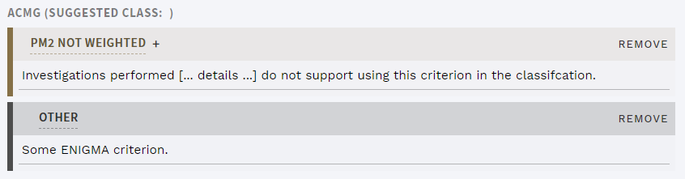

# Release notes: Latest release

See [older releases](/releasenotes/olderreleases.md) for earlier versions.

## Version 1.8

Release date: 30.10.2019

### Highlights

#### Add "other" and unweighted ACMG criteria

Sometimes, criteria that don't match the ACMG guidelines are important for a variant interpretation, e.g. the ENIGMA criteria for the BRCA1/BRCA2 genes. ELLA now allows adding these to the interpretation as a generic `OTHER` criterion. The type and impact on the classification should be given in this criterion's comment field once added. 

In addition, users can often spend significant time evaluating an ACMG criterion for a particular interpretation, but in the end decide that the requirements are not met. ELLA now allows setting an added ACMG criterion as `NOT WEIGHTED`, so that comments related to this work can be properly recorded.

    
     
    

        <strong>Figure: </strong>The new "other" criterion and unweighted option for ACMG criteria.
    

     

Note that neither "other" or unweighted ACMG criteria are counted in the calculation of suggested classification.

#### Filter improvements: Gene and allele ratio

The filter settings now allows using genes as a variable in rules for filters or exceptions. This allows conditioning any rule on the presence/absence of a gene, e.g. exclude certain genes from a particular filter.

In addition, it is now also possible to use allele ratio (alternative allele reads/total reads) as a variable in the quality filter. In our experience, this gives a more powerful filter than using the `qual` variable, especially for high sequencing depths. A caveat is that mosaic variants may be missed, but this can be partially be circumvented by adding particular genes where mosaics are expected to a gene exclusion rule as described above.

### All changes

<!-- MR !324 -->
- [Added possibility for adding non-ACMG criteria](#acmg-add-other-and-unweighted-criteria).
<!-- MR !324 -->
- [Added possibility for setting ACMG criteria as unweighted](#acmg-add-other-and-unweighted-criteria).
<!-- MR !327 -->
- [Added possibility to filter out or rescue variants in specific genes](#filter-improvements-gene-and-allele-ratio).
<!-- MR !331 -->
- [Added possibility to use allele ratio in quality filter](#filter-improvements-gene-and-allele-ratio).
<!-- MR !317 -->
- Added possibility to configure irrelevant references to be automatically IGNORED; see [Technical documentation](/technical/uioptions.html#define-references-as-ignored) for details.
<!-- MR !318 -->
- Made controls FULL - QUICK - VISUAL and INDICATION comment field in the sidebar sticky to reduce need for scrolling when there are many variants.
<!-- MR !318 -->
- Made collision warnings below the top bar sticky and collapsible.
<!-- MR !325 -->
- Increased number of retrieved reference search results. 
<!-- MR !332 -->
- Added "Documentation" link to all pages.
<!-- MR !333-->
- Added possibility to copy gene + transcripts from filtered results in GENE PANEL INFO.
<!-- MR !333-->
- Fixed bug that caused non-working filtering in GENE PANEL INFO if using wrong case.
<!-- MR !320 -->
- Fixed bug resulting in empty interpretation window when no variant was selected.
<!-- MR !326 -->
- Fixed bug causing no alerts when navigating away from interpretation view with unsaved work.
<!-- MR !334 -->
- Import jobs now show time of day when job was started, and time stamp when status of job last changed.
<!-- MR !319 -->
- Improved [Technical documentation](/technical/).

