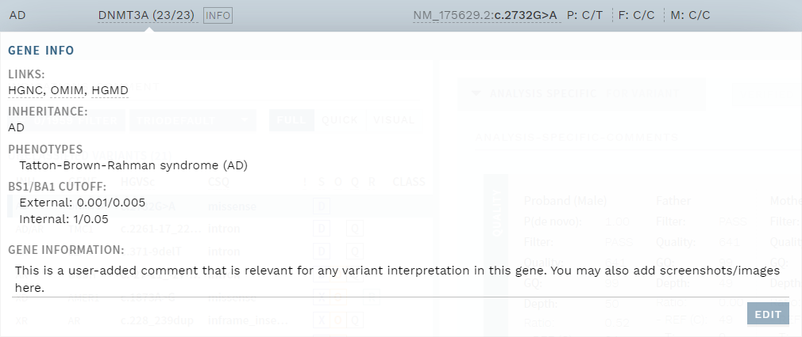
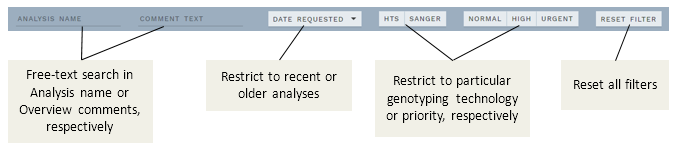

# Release notes: Latest releases

|Major versions|Minor versions|
|:--|:--|
[v1.11](#version-1-11)|
[v1.10](#version-1-10)|[v1.10.1](#version-1-10-1)

See [older releases](/releasenotes/olderreleases.md) for earlier versions.

## Version 1.11

Release date: 25.06.2020

### Highlights

This release brings an improved gene information popup with editing possibilities, and several changes and improvements to the OVERVIEW page. 

#### User-editable gene information

The [gene information popup](/manual/top-bar.html#gene-information) (click the gene name in the top bar) has been improved, with the possibility to add and edit comments about the gene. This can be used for information that is important for evaluating variants in this gene, and is available for all analyses where the gene is included.  

    
     
    

        <strong>Figure: </strong>User-editable gene information.
    

     

If a comment has been added, an `INFO` tag is shown next to the gene name. 

#### New OVERVIEW filter feature

A new [filter feature](/manual/choosing-sample-variant.html#filter-the-overview) was added to the ANALYSES OVERVIEW page to quickly locate subsets of analyses. You can filter by these parameters: 

- Analysis name
- Comment text (e.g. useful with [auto-comments](#custom-overview-sections-replaced-with-auto-comments))
- Date requested (ranges up to current date)
- Show only 
    - HTS/Sanger
    - Priorities Normal/High/Urgent

Any combination of these filters is allowed.

    
     
    

        <strong>Figure: </strong>User-editable gene information.
    

     

Note that the filters do _not_ include finalized analyses. 

#### Custom OVERVIEW sections replaced with auto-comments

This release retires the custom sections on the OVERVIEW page and replaces them with a possibility to [auto-add comments](/manual/choosing-sample-variant.html#optional-auto-comments) (`ALL CLASSIFIED`/`NO VARIANTS`) upon deposit of new analyses to the ELLA database. In addition, the [VARIANTS OVERVIEW](/manual/choosing-sample-variant.html#variants-worklist) page has been limited to manually imported, stand-alone variants or individual variants opened from search, and is now available for all users independent of configuration. 

### All changes

<!-- MR !422 -->
- [Added possibility to edit and save gene information](#user-editable-gene-information).
<!-- MR !420 -->
- [Added filtering feature in the ANALYSES OVERVIEW](#new-overview-filter-feature).
<!-- MR !426 -->
- [Replaced optional ANALYSES OVERVIEW sections with auto-comments](#custom-overview-sections-replaced-with-auto-comments)
- Fixed a bug causing previously cleared warning tags to remain in the Finalized section and in search results.

## Version 1.10.1

Release data: 15.06.2020

### Highlights

This release fixes a few bugs bugs related to references and reference assessments.

### All changes
<!-- MR !424 -->
- Fixed a bug where existing reference assessments would not show if no longer part of annotation
<!-- MR !427 -->
- Fixed a bug where ClinVar references would not be recognized during import of ClinVar annotation
<!-- MR !428 -->
- Fixed a bug where HGMD reference comments would display un-translated character sequences

## Version 1.10

Release date: 09.06.2020

### Highlights

This release brings improvements to the variant filters, a new version of IGV for Visual mode, as well as several smaller improvements and fixes. 

#### Improved variant filters

All criteria in the [segregation filter](/technical/filtering.html#segregation-filter) can now be enabled/disabled separately, allowing for increased flexibility. In addition, the [quality filter](/technical/filtering.html#quality-filter) can now use the VCF `FILTER` status (`PASS`/...) as a parameter. 

### All changes

<!-- MR !409; also updated filtering.md --> 
- [Added configuration for segregation filter](#improved-variant-filters).
<!-- MR !416; also updated filtering.md -->
- Renamed "Inherited mosaicism" to "[Parental mosaicism](/technical/filtering.html#parental-mosaicism)"; The associated [`M` tag](/manual/side-bar.html#variant-tags) can now appear together with other Segregation tags in the sidebar if multiple conditions are true.
<!-- MR !368; also updated filtering.md -->
- [Added possibility for using VCF `FILTER` status in quality filter](#improved-variant-filters).
<!-- MR !417; also updated evidence-sections.md -->
- Removed `QUAL`≤300 as a criterion for the [NEEDS VERIFICATION warning](/manual/evidence-sections.html#warning-needs-verification) and the [`Q` tag](/manual/side-bar.html#variant-tags).
<!-- MR !397 -->  
- Upgraded IGV (in Visual mode) to version 2.5.4, with several minor improvements.
<!-- MR !419; also updated top-bar.md -->
- The number shown on the `WORK LOG` button now includes a count of all user added messages, including from previously finalized analysis rounds.
<!-- MR !370 -->
- Removed `VARIANT REPORT` button from OVERVIEW.
<!-- MR !410 -->  
- Open the previously selected overview page when returning from search.
<!-- MR !407 --> 
- Fixed a bug causing wrong open-end position for insertions.
<!-- MR !411 -->
- Fixed a bug causing incorrect filtering for regions with 1 base.
<!-- MR !421 --> 
- Fixed a bug causing incorrect rescue of variants annotated with non-standard terms in the ClinVar database.
<!-- MR !412 --> 
- Fixed a bug causing a wide sidebar with long indication comments.
<!-- MR !418 -->
- Fixed a bug causing missing word wrap in comment fields.
<!-- MR !377 Add flake8: no release note necessary -->

