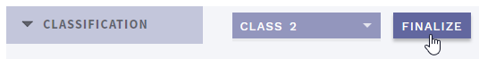
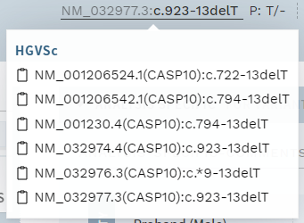

# Release notes: Latest releases

See [older releases](/releasenotes/olderreleases.md) for earlier versions.

## Version 1.9.1

Release date: [TBD]

### Highlights

This version adds bugfixes and improvements to the finalize variant functionality introduced in version 1.9, support for a new version of VEP, as well as several minor UI improvements. 

### All changes

#### Finalize variant fixes and improvements
<!-- MR !375 -->
- Disallow finalize for an analysis when there are unsaved changes in REPORT (CLASSIFICATION page, user must push `SUBMIT REPORT` first).
- Added button for [undoing changes](/manual/classification-section.html#update-submit-report-only) to REPORT comment on CLASSIFICATION page.
<!-- MR !376 -->
- Fixed issue where variants present in multiple proband samples within an analysis could not be finalized.

#### Support for new VEP version
<!-- MR !371 -->
Added support for updated version of VEP (v98.3), including fixes for:
- Fetching latest HGNC symbol (using RefSeq GFF files).
- Choosing the correct RefSeq transcript version. If possible, the version specified in the gene panel is chosen, otherwise the latest available version is used.

#### Other UI improvements and bugfixes 
<!-- MR !369 -->
- Added auto-scroll to top in main window when switching between variants in ANALYSES view.
<!-- MR !367 -->
- Changed `HI FREQ` and `HI COUNT` in QUICK mode to display `0` instead of `-` when all sources report 0 frequency.
<!-- MR !378-->
- Adjusted position of modals to allow viewing variant information in top bar when modal is open.
<!-- MR !387 -->
- Removed `COPY ALL TO ALAMUT` button.
<!-- MR !381 -->
- Changed default view in WORKLOG to `MESSAGES ONLY`.
<!-- MR !382 -->
- Increased custom gene panel name character limit to 20.
<!-- MR !385 -->
- Increased height of batch filter box when creating custom gene panels.
<!-- MR !384 -->
- Adjusted delay for popovers.
<!-- MR !364 -->
- Improved help text for RIS format import.

<!-- MR !386 -->
- Fixed word wrap in popover comment fields (ACMG comment and WORKLOG).
<!-- MR !379 -->
- Fixed an issue with wrong navbar height calculation causing extra scrollbars and wrong page height.
<!-- MR !383 -->
- Fixed bug where variants with no transcripts were not filtered on frequency.

## Version 1.9

Release date: 31.01.2020

### Highlights

This version adds changes to better support larger number of users and user groups using the same variant interpretation database. 

#### Finalize variants in analyses

The most important change in this version is the addition of a "finalize variant" function in analyses. This allows variant interpretations to be released for overlapping analyses (where the same variant is present in more than one non-finalized analysis workflow) as quickly as possible. This also means that workflow collision warnings are given per variant instead of per analysis, reducing the number of displayed warnings.

With this change, each variant with a new/updated classification in an analysis needs to be finalized by pressing the new `FINALIZE` button in the CLASSIFICATION section before the analysis (sample) itself can be finalized:

    
     
    

        <strong>Figure: </strong>New button to finalize variant in analysis.
    

     

Note that this also needs to be performed for any classification done in [QUICK mode](/manual/quick-classification.md), and that interpretations done in VARIANTS mode (stand-alone variants e.g. from search) still need to be finalized as before via the `FINISH` button in the top bar before the variant is considered truly finalized. 

#### User group warnings

Finalizing variants means each variant interpretation will be tagged with the main responsible user and user group. This also allows showing a warning if the previous (finalized) variant interpretation was performed by a user from another user group than your own: 

    
     
    

        <strong>Figure: </strong>New user group warning.
    

     

#### Copy text by mouse-click

You can now more easily copy text from many pop-overs by clicking on the text. Look for the clipboard symbol, e.g. in the HGVS cDNA variant name in the top bar: 

    
     
    

        <strong>Figure: </strong>New option to copy text directly by mouse-click in popups.
    

     

### All changes

<!-- MR !341 -->
- [Finalize variant in analysis](#finalize-variants-in-analyses)
<!-- MR !346 -->
- [Display warning when variant was finalized by different group](#user-group-warnings)
<!-- MR !350 -->
- Mouse popovers and tooltips now use [tippy.js](https://atomiks.github.io/tippyjs/), with possibility for [copying text by mouse-click](#copy-text-by-mouse-click) (any text marked with a clipboard symbol).
<!-- MR !358 -->
- Optional sections on the ANALYSES OVERVIEW page have been simplified, see [ANALYSIS worklist](/manual/choosing-sample-variant.html#optional-analyses-view). 
<!-- MR !360 -->
- Added analyses with variants that need verification for optional automatic sorting to NOT READY section on the ANALYSES OVERVIEW page (see [Deposit](/technical/import.html#deposit)).
<!-- MR !356 -->
- Added support for importing references with .RIS format from the [new PubMed webpage](https://pubmed.ncbi.nlm.nih.gov/).
<!-- MR !347 -->
- Entries listed in the STUDIES & REFERENCES section are now shown with annotation source and better separation. 
<!-- MR !341-->
- `MARK CLASS 2` button has been removed from the FREQUENCY section (CLASSIFICATION page).
<!-- MR !359-->
- Added condition to the [Inherited mosaicism filter](/technical/filtering.html#inherited-mosaicism) to exclude cases where the other parent has a normal genotype. 
<!-- MR !355 -->
- ACMG criteria now have short descriptions available everywhere.
<!-- MR !348 -->
- All action buttons are now disabled until all data has been loaded when opening an analysis.
<!-- MR !365 -->
- Improve the performance of the region filter
<!-- MR !349 -->
- Most configuration settings that were previously hard coded in `/src/api/config/config.py` have now been replaced by a dynamic configuration, set by the environment variable `ELLA_CONFIG`. See `/example_config.yml` for examples.
<!-- MR !354 -->
- Fixed issue during import when re-importing previously deleted analyses.
<!-- MR !351 -->
- Changes to the documentation, including moving the "Concepts" section to the [User manual](/manual/concepts.md). 

