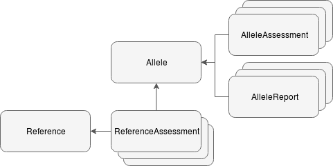

# Datamodel

[[toc]]

The datamodel is defined using [SQLAlchemy](https://www.sqlalchemy.org).

It's implementation can be found in `src/vardb/datamodel/`.

The main concepts of the datamodel are described below. For a complete list of tables and fields check the code.

## Introduction
The variants are interpreted in a stepwise **workflow**, either one variant at a time or several ones in an analysis. An **analysis** is the set of variants that are found in a patient **sample** using a **gene panel** as variant filter. From one sample there can be multiple analyses, one for each gene panel chosen. In a workflow the work is done across several **interpretations**, with the last being **finalized** (usually) by a different user than the ones having done the previous interpretations. The previous interpretations  are marked for **review**. The workflow goes through start-review-finalize phases.

When a workflow is finalized one or several **assessments** are either reused or created. The result and context of each step is captured in a **snapshot** enabling time-travelling. The assessment includes a classification (1-5). A description intended for the referring doctor is persisted as a **report**. The references relevant for the assessment is captured separately in a **reference assessment**. When interpreting variants in an analysis it's common practice to reuse assessments and reports made earlier.
 
## Common features
To enable time-travelling and auditing, data is generally not over-written. Instead copies are made and old and new entities are linked together.

To implement this most models have these fields:
- Date of creation
- Date when the object became superceded
- The id of the new object that "replaces" it

Models with previous/current semantics are:
- Annotations
- Allele assessments
- Reference assessments
- Allele report
- Reference assessments

## Genetic data and annotation
Genetic data, currently genetic variation represented as SNVs and indels, are stored in the `allele` table.

### Allele
An [allele](https://www.nature.com/scitable/definition/allele-48) is a variant form of a gene. It's among the most important objects in the model. If combined with an annotation it can exists in isolation.
 
An allele has:

- Reference genome version
- Chromosome
- Start and stop position
- Change from/to
- Change type (snv, ins, del, indel)
- Original vcf entries (REF, ALT, POS)

### Annotation
The annotation contains information about a *single* allele's population frequencies, predicted effects and various other data from external databases. Annotation can change often, and whenever it is updated, the previous annotation is archived. Therefore there is only one current annotation for every allele. The current annotation points to the previous to keep track on historic annotations. 

The annotation is created outside *ella* by the pipeline.

The annotation has:
- The actual annotation data (json)
- Link to an allele

The user-generated annotation (called **custom annotation**) is separate from the pipeline generated.

#### AnnotationShadow
In order to aid performance when filtering and searching, parts of the annotation JSON data are shadowed into separate tables. These tables are updated by triggers on the `annotation` table and should never be modified manually. They only contain data for the latest annotation for an allele. They have indexes on more or less all columns.

Currently there are two such tables: `annotationshadowtranscript` and `annotationshadowfrequency`.

### Genotype
The pair of alleles is described by the **Genotype**. If homozygous only one allele is defined.

The genotype is connected to/has:
- Sample
- Analysis
- Genotype quality
- Variant quality

## Classifications and assessments
The *official* classification (1-5) and complementary data such as AMCG codes and comments are stored in **AlleleAssessment**.

The assessment has:
- Classification (1-5)
- Evaluation (json, free tekst and ACMG codes)
- Link to allele
- Gene panel
- Annotation

Assessments with class 3-5 are valid for a limited period of time before a new interpretation is required. The *date created* field of *AlleleAssessment* is thus critical.

### AlleleReport
The information sent to doctors for each variant/allele is kept separate from the assessment itself. The report  can be updated without changing i.e. the classification.
 
The allele report has:
- Free text (json)
- Link to the assessment

### Reference
A reference to research literature with data such as:
- Title
- PubMed ID
- Abstract

The references can either batch imported using data download from XX or uploaded one-by-one by the user in the tool itself.

### ReferenceAssessment
Assessing a reference is done in the context of a variant and a gene panel. The user can add tags/text the highlight the info that's relevant for the variant being interpreted.

A reference assessment has:
- Link to reference
- Link to allele
- Evaluation (json: text, ACMG codes, tags)

## Analyses and samples
 

An **Analysis** is bioinformatic calcalutation producing a list of variants that are to be interpreted. An analysis is done in the context of a specific gene panel used as a basis for variant filtering. The sequencing data is taken from a **Sample**. The data from a sample can be used in different analyeses, and the database will have a pair of sample/analysis for each. Thus there can be multiple rows for the same physical sample.

An Analysis has:
- Gene panel
- A priority (for prioritizing the interpretation work)
- Various data (like comment, tags)
- The history of interpretations for the analysis' variants

A Sample:
- Identifies the physical sample/sequencing data
- The analysis to be done on the data
- The source of the sequencing data (Sanger, HTS)
- Mentions models that have a link to *Analysis* and why.

## Workflow
In the step-wise process of interpreting variants and analyses, each step/round is saved in either **AlleleInterpretation** or **AnalysisInterpetation**. They are very similiar with InterpretationMixin as the common basis, see [Mixins](http://docs.sqlalchemy.org/en/latest/orm/extensions/declarative/mixins.html)

Each round (created when starting, setting to review or finalizing) captures the work of the user (comments, ACMG codes, references assessed etc) and UI-specific properties. We can refer to this data as **state** (interpretation and ui state?). The info is persisted as a json field called 'state'. Each time the users clicks 'Save' the state field is updated, and the previous state is appended to the list 'state_history' (json).

For each round (clicking Reopen/Review) a new Interpreation is created with the state (and some other fields) copied from the previous Interpretation.

See diagram (S=state, [..] list of previous states):

     AnalysisInterpretation: S [] --save--> S' [S] --save--> S'' [S' S] etc
           |
	     Review
	       |
	      \/
     AnalysisInterpretationState':  S'' [] --save--> S''' [S''] --save--> S'''' [S''' S''] etc

In addition to passing the state to a new round,  the context of the interpretation is persisted in so-called snapshot objects.

### Interpretation snapshots
The context of each interpretation round is saved in either AnalysisInterpretationSnapshot or AlleleInterpretationSnapshot, depending on the type of worklow.For each allele (in allele workflow there is only one) one snapshot instance is saved.

The context saved in a snapshot:
- The annotation
- Custom annotation created by the user
- The assessment (if any) that already existed and was displayed to user
- The report (if any) that already existed and was displayed to user 

When finalizing the snapshow also contain:
- The assessment (including the classification) made by the user
- The reference assessments made by the user
- The report made by the user

The snapshot is also linked to the interpretation round (AlleleInterpretation or AnalysisInterpretation) having the state info. This enables a time-travelling feature where the tool can show the info that was available at the end of the round.

### Finalizing an interpretation
When a round is finalized, the interpretation work is persisted by creating (possibly many) AlleleAssessments, ReferenceAssessments and AlleleReports. The user can choose to reuse existing objects; so after a finalization the number of new objects won't always be the same as number of alleles.

[**Diagram:**]

       Mark review:  SnapshotCreator (creates AlleleInterpretationSnapshot or AnalysisInterpretationSnapshot)
       Finalize:     SnapshotCreator
	          AssessmentCreator (creates AlleleAssessment, ReferenceAssessment)
	          AlleleReportCreator (creates AlleleReport)

Relate to loading data from backend when starting interpretation.